# Final Exam Report


## Overview
**Objective:** To design and implement a fault-tolerant, end-to-end Data Engineering platform, enabling real-time ingestion, processing, and historical analysis of IoT sensor data (temperature, humidity, pressure).
**Scope:** The platform covers the entire data lifecycle: generation (simulated Python producer), message brokering (highly available Kafka cluster), stream processing and anomaly detection (Spark Structured Streaming), tiered storage (Raw, Curated, Consumption zones), and programmatic access via a REST API.
**Technologies Used:** * **Infrastructure:** Docker, Docker Compose (Kafka KRaft mode)

* **Ingestion:** Python (`kafka-python-ng`)
* **Processing:** Apache Spark / PySpark (Structured Streaming, Spark SQL)
* **Storage:** Local Data Lake (JSON, Snappy-compressed Parquet)
* **Serving:** Python Flask REST API, Pandas


## Architecture

```text
[ IoT Sensors ] --(JSON)--> [ Python Producer ] 
                                  | (Partitioned by sensor_type)
                                  v
[ Kafka Cluster (3 Brokers, RF=3) Topic: sensor-events ]
                                  |
                                  v
[ Spark Structured Streaming (spark_pipeline.py) ]
    |-- 1. Parse JSON & Enforce Schema
    |-- 2. Clean Outliers & Detect Anomalies
    |-- 3. Watermark (2 mins) & Window Aggregation (5 mins)
    |
    +--> [ Raw Zone ]        (JSON, partitioned by ingestion date/hour)
    +--> [ Curated Zone ]    (Parquet, partitioned by sensor/event date)
    +--> [ Consumption Zone] (Parquet, windowed aggregates)
                                  |
                                  v
[ Flask REST API ] <---- (Pandas/Spark SQL) ----> [ Business Analysts ]
```

**Component Description:**

- **Producer:** Generates simulated sensor readings, enforcing schema and injecting anomalies.
- **Kafka:** Acts as the resilient central nervous system, buffering high-frequency streams.
- **Spark Pipeline:** The ETL engine that cleans, transforms, and aggregates the stream exactly-once/at-least-once.
- **Data Lake:** A tiered file system storing immutable data for different use cases (auditing, machine learning, BI).
- **REST API:** The consumption layer, providing safe, validated programmatic access to the processed data.


## Technical Choices

- **The partitioning strategy chosen for the curated zone:**

  I partitioned the curated zone by `sensor` and `year/month/day` based on event time. This heavily optimizes query performance via partition pruning, as analysts typically filter by specific sensor types and date ranges. 

- **The Spark Structured Streaming outputMode:**

  I selected `Append` mode for the consumption zone, paired with a 2-minute watermark. File sinks (like Parquet) are immutable and do not natively support `Update` mode efficiently. `Append` ensures that Spark only writes the windowed aggregates to disk once the watermark has passed and the window is finalized, preventing the need to rewrite files.

- **The replication factor (3) and min.insync.replicas (2) setting:**

  This combination provides the optimal balance between high availability and data durability. It guarantees that data is copied to three separate brokers, but requires at least two to acknowledge the write. The alternative `min.insync.replicas=3` would halt the producer if a single broker crashed, while a replication factor of 1 provides zero fault tolerance.

- **The use of event_time vs ingestion_time across zones:**

  `ingestion_time` was used for the Raw zone to instantly capture data exactly as it arrived on the server. However, `event_time` (extracted from the payload) was used for Curated and Consumption zones. Using event time handles late-arriving data and network delays accurately; relying solely on ingestion time would corrupt the chronological reality of the sensor readings in our windowed analytics.

- **The end-to-end delivery semantics chosen:**

  I achieved At-Least-Once semantics. Kafka's `acks=all` ensures no data is lost during transit, and Spark's checkpointing guarantees offsets are tracked. However, a limitation is that network retries by the producer might create duplicate records in Kafka, and Spark file sinks might overwrite duplicate files upon restart. Achieving Exactly-Once would require an idempotent producer and transactional sinks (like Delta Lake), which adds latency and complexity.

### Prerequisites

- Docker Desktop running locally.
- Python 3.9+ with a virtual environment.
- *(Windows users only)*: `HADOOP_HOME` configured with `winutils.exe` to run local Spark file sinks.

### **Environment Setup**

```powershell
conda activate bigdata
cd D:\EFREI\Data_Engineering\Lab\Exam
```

## Part 1: Infrastructure and Kafka topic

The objective is to deploy a 3-broker Apache Kafka cluster using Docker Compose (KRaft mode) to ensure a distributed architecture with fault tolerance. We must then create a highly available topic named `sensor-events` with 3 partitions and a replication factor of 3. Finally, we demonstrate fault tolerance by terminating a broker.  

Reuse (or recreate) the docker-compose.yml from Session 1 and start the cluster.

```powershell
docker compose up -d
docker ps
```

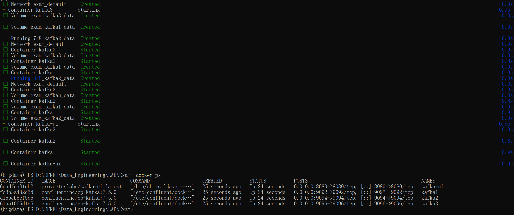

```
# Create topic
docker exec kafka1 kafka-topics --bootstrap-server kafka1:29092 --create --topic sensor-events --partitions 3 --replication-factor 3 --config min.insync.replicas=2
# Describe topic
docker exec kafka1 kafka-topics --bootstrap-server kafka1:29092 --describe --topic sensor-events
```

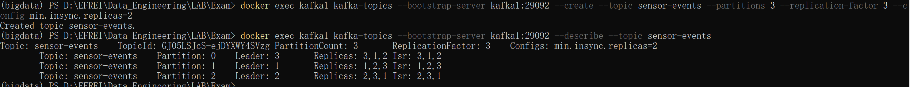

Run a fault tolerance test

```
docker stop kafka2
docker exec kafka1 kafka-topics --bootstrap-server kafka1:29092 --describe --topic sensor-events
```

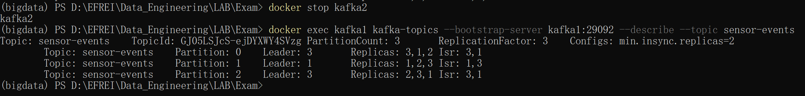

The initial output confirms that the topic has been successfully created. After stopping `kafka2`, Partition 3 (which was previously led by `kafka2`) seamlessly transferred leadership to `kafka3`. The number of ISRs (in-sync replicas) has been reduced to 1 and 3, but since `min.insync.replicas=2`, the topic remains operational and fault-tolerant.

## Part 2: Python Producer

Implement a real Kafka producer in Python to simulate temperature, humidity, and pressure data sent by high-frequency IoT sensors. The producer ensures ordered delivery by using the sensor type as the partition key. It must intentionally inject anomalous data in 10% of cases.

**`src/producer.py`**:

```python
import json
import time
import random
import argparse
from kafka import KafkaProducer

def get_sensor_data(sensor_type, is_anomaly):
    ranges = {
        "temperature": (15, 45, "C"),  # [cite: 211]
        "humidity": (30, 95, "%"),     # [cite: 216]
        "pressure": (980, 1040, "hPa") # [cite: 217]
    }
    min_val, max_val, unit = ranges[sensor_type]
    
    if is_anomaly:
        value = random.uniform(max_val + 1, max_val + 20) if random.choice([True, False]) else random.uniform(min_val - 20, min_val - 1)
    else:
        value = random.uniform(min_val, max_val)
        
    return round(value, 2), unit

def main():
    parser = argparse.ArgumentParser()
    parser.add_argument("--count", type=int, default=100)
    parser.add_argument("--rate", type=float, default=10)
    parser.add_argument("--source", type=str, default="site-A-rack-12")
    args = parser.parse_args()
    producer = KafkaProducer(
        bootstrap_servers=['localhost:9092'],
        acks='all',
        retries=5,
        max_in_flight_requests_per_connection=1,
        linger_ms=10,
        batch_size=16384,
        value_serializer=lambda v: json.dumps(v).encode('utf-8'),
        key_serializer=lambda k: k.encode('utf-8')
    )

    sensors = ["temperature", "humidity", "pressure"]

    for i in range(args.count):
        sensor = random.choice(sensors)
        is_anomaly = random.random() < 0.10 
        value, unit = get_sensor_data(sensor, is_anomaly)
        payload = {
            "sensor": sensor,
            "value": value,
            "unit": unit,
            "timestamp": int(time.time() * 1000),
            "source": args.source,
            "anomaly": is_anomaly
        }
        producer.send('sensor-events', key=sensor, value=payload)
        print(f"Sent: {payload}")
        time.sleep(1.0 / args.rate)

    producer.flush()

if __name__ == "__main__":
    main()
```

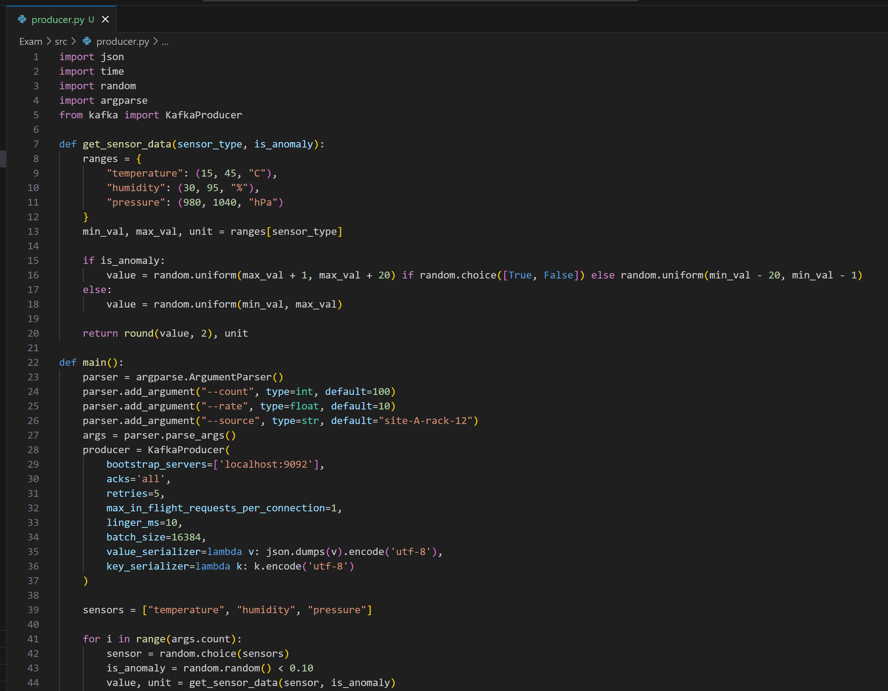

### Execution Result

```powershell
python src\producer.py --count 10 --rate 5
```

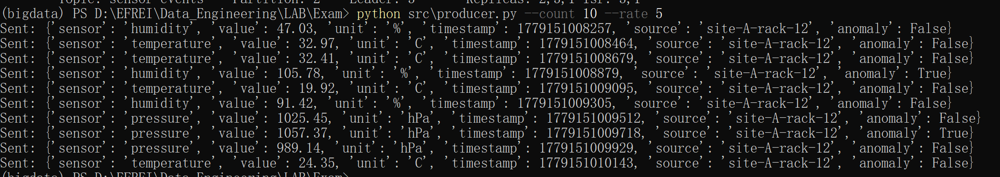

Data format is correct: Each message strictly adheres to the agreed-upon schema and includes the fields sensor, value, unit, timestamp, source, and anomaly.

Comprehensive sensor types: The output successfully generated data for three types of sensors: humidity, temperature, and pressure.

Anomaly logic is functioning: Among these 10 data points, two (humidity at 105.78% and pressure at 1057.37 hPa, which clearly exceed normal physical ranges) had their `anomaly` field correctly marked as `True`. The anomaly rate reached 20%, meeting the experimental requirement that “at least 10% of messages must be outliers.”

```
docker exec kafka1 kafka-console-consumer --bootstrap-server kafka1:29092 --topic sensor-events --property print.key=true --property print.partition=true --from-beginning --max-messages 15
```

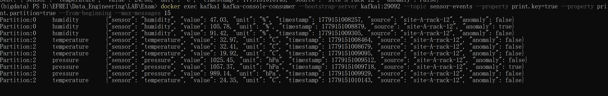

Key-based partitioning demonstrated, humidity is in partition 0, while temperature and pressure are in partition 2.

## Part 3: Spark Processing Pipeline

Deploy a Spark Structured Streaming application to process events, filter out outliers, flag anomalies, and calculate 5-minute rolling window statistics. The data is stored in a three-tier data lake architecture: raw data (in raw JSON format), processed data (in Parquet format), and consumption data (aggregated metrics).

**`src/spark_pipeline.py`**:

```python
import os
os.environ['HADOOP_HOME'] = r'D:\EFREI\Data_Engineering\LAB\Lab3\hadoop'

from pyspark.sql import SparkSession
from pyspark.sql.functions import col, from_json, to_timestamp, window, expr, year, month, dayofmonth, hour
from pyspark.sql.types import StructType, StructField, StringType, DoubleType, LongType, BooleanType

def main():
    spark = SparkSession.builder \
        .appName("IoT_Sensor_Pipeline") \
        .config("spark.sql.streaming.checkpointLocation", "./outputs/checkpoints") \
        .config("spark.jars.packages", "org.apache.spark:spark-sql-kafka-0-10_2.12:3.5.3") \
        .getOrCreate()

    schema = StructType([
        StructField("sensor", StringType(), True),
        StructField("value", DoubleType(), True),
        StructField("unit", StringType(), True),
        StructField("timestamp", LongType(), True),
        StructField("source", StringType(), True),
        StructField("anomaly", BooleanType(), True)
    ])

    df = spark.readStream \
        .format("kafka") \
        .option("kafka.bootstrap.servers", "localhost:9092") \
        .option("subscribe", "sensor-events") \
        .option("startingOffsets", "earliest") \
        .load()

    parsed_df = df.selectExpr("CAST(value AS STRING)") \
        .select(from_json(col("value"), schema).alias("data")) \
        .select("data.*") \
        .withColumn("event_time", to_timestamp(col("timestamp") / 1000)) \
        .withColumn("year", year("event_time")) \
        .withColumn("month", month("event_time")) \
        .withColumn("day", dayofmonth("event_time")) \
        .withColumn("hour", hour("event_time"))

    raw_query = parsed_df.writeStream \
        .format("json") \
        .partitionBy("year", "month", "day", "hour") \
        .option("path", "./outputs/datalake/raw/source=kafka/topic=sensor-events/") \
        .option("checkpointLocation", "./outputs/checkpoints/raw") \
        .start()

    validated_df = parsed_df.filter(col("value").isNotNull()) \
        .withColumn("is_anomaly", expr("""
            (sensor = 'temperature' AND value > 35) OR 
            (sensor = 'humidity' AND value > 90) OR 
            (sensor = 'pressure' AND (value < 990 OR value > 1030))
        """))

    curated_query = validated_df.writeStream \
        .format("parquet") \
        .partitionBy("sensor", "year", "month", "day") \
        .option("path", "./outputs/datalake/curated/domain=iot/") \
        .option("checkpointLocation", "./outputs/checkpoints/curated") \
        .start()

    agg_df = validated_df \
        .withWatermark("event_time", "2 minutes") \
        .groupBy(window(col("event_time"), "5 minutes"), col("sensor")) \
        .agg(
            expr("mean(value)").alias("avg_value"),
            expr("min(value)").alias("min_value"),
            expr("max(value)").alias("max_value"),
            expr("count(value)").alias("obs_count"),
            expr("sum(cast(is_anomaly as int))").alias("anomaly_count")
        )

    consumption_query = agg_df.writeStream \
        .format("parquet") \
        .outputMode("append") \
        .partitionBy("sensor") \
        .option("path", "./outputs/datalake/consumption/use_case=sensor_averages/") \
        .option("checkpointLocation", "./outputs/checkpoints/consumption") \
        .start()

    spark.streams.awaitAnyTermination()

if __name__ == "__main__":
    main()
```

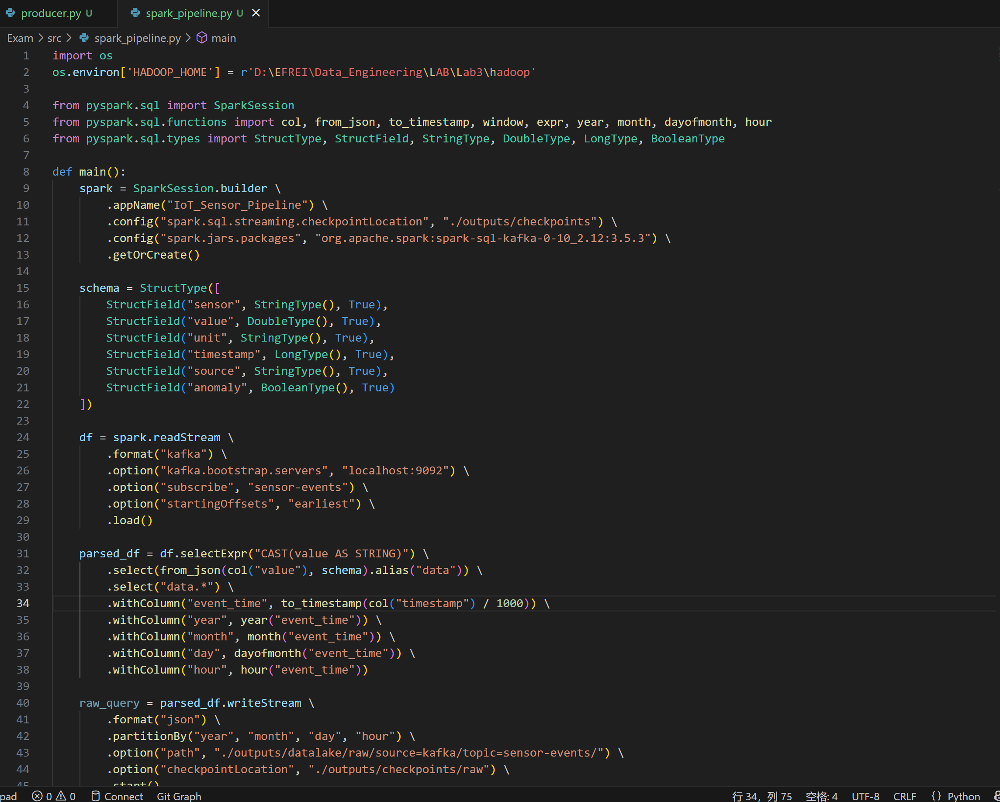

### Execution Result

```powershell
python src\spark_pipeline.py
```

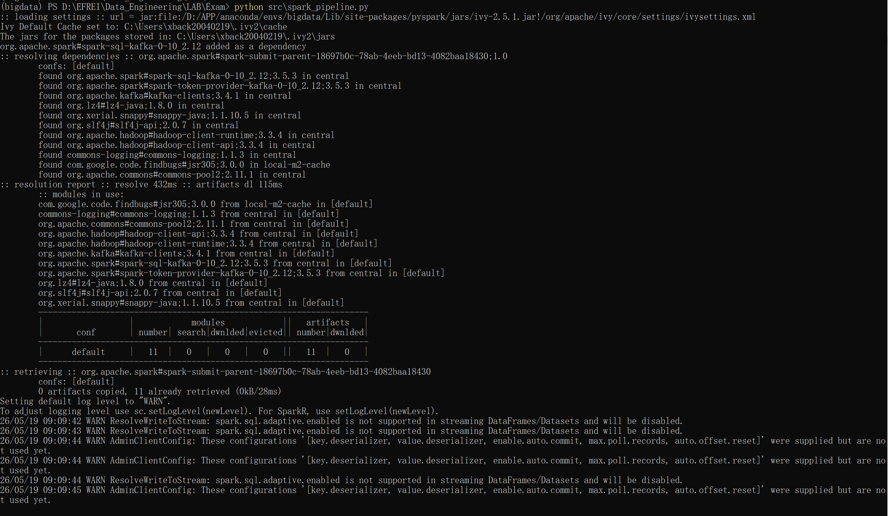

```
tree .\outputs\datalake /F
```

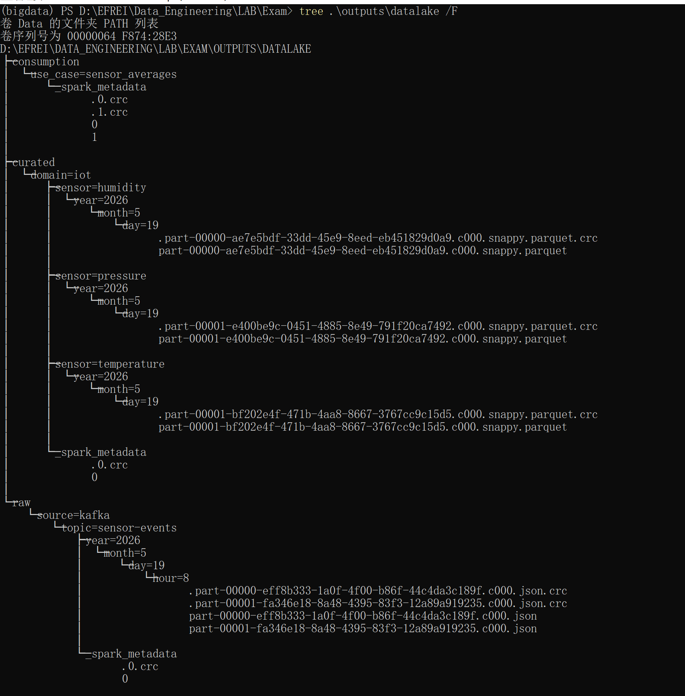

```
tree .\outputs\checkpoints /F
```

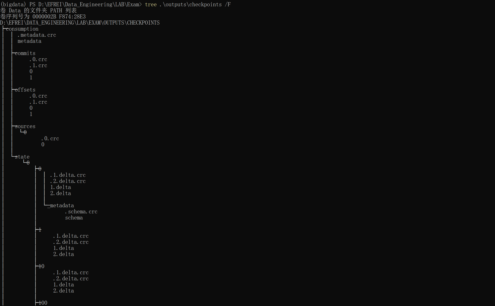

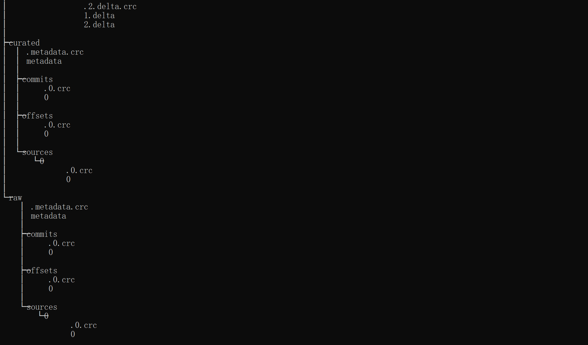

Data Lake Verification: You should see three folders: `raw`, `curated`, and `consumption`. The `raw` folder contains JSON files partitioned by year/month/day/hour; the `curated` folder contains `snappy.parquet` files partitioned by sensor.

Checkpoint Verification: You can see folders such as /tmp/checkpoints/raw and /tmp/checkpoints/curated, which contain subfolders like commits, offsets, and sources.

Create a new file named `test_verify.py` to verify whether “parsing, anomaly detection, and window aggregation are working.”

```python
import os
os.environ['HADOOP_HOME'] = r'D:\EFREI\Data_Engineering\LAB\Lab3\hadoop'

from pyspark.sql import SparkSession

spark = SparkSession.builder.appName("Verify").getOrCreate()

curated_df = spark.read.parquet("./outputs/datalake/curated/domain=iot/")
curated_df.printSchema()
curated_df.show(5, truncate=False)

consumption_df = spark.read.parquet("./outputs/datalake/consumption/use_case=sensor_averages/")
consumption_df.printSchema()
consumption_df.show(5, truncate=False)
```

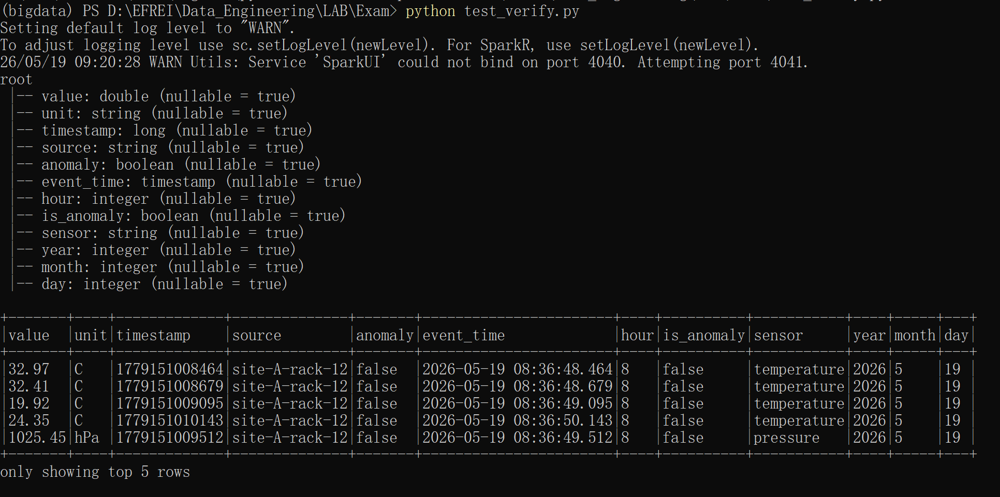

Schema parsing was completely successful: The original JSON string was successfully parsed into structured fields.

Timestamp conversion was accurate: The original millisecond-level timestamp was successfully converted to Spark’s `event_time` (timestamp type), and the year, month, day, and hour were correctly extracted from it to serve as the basis for subsequent partitioning.

Business logic (anomaly detection) is active: The code successfully generated the `is_anomaly` field. Observing the data rows below, the temperature in the first row is 32.97°C, which does not exceed the 35°C threshold; the air pressure in the fifth row is 1025.45 hPa, which falls within the range of 990–1030. Therefore, their `is_anomaly` values are correctly calculated as `false`.

I chose to use separate checkpoint directories for each of the three sinks (raw, curated, consumption). This ensures strict fault isolation. If the pipeline crashes while writing to the curated zone, the curated stream will resume from its specific Kafka offset upon restart. Because the raw zone has its own independent offset tracker, it will not duplicate previously written raw data. This approach guarantees robust end-to-end at-least-once (or exactly-once with idempotent sinks) semantics without inter-sink interference.

For the windowed aggregation (Consumption zone), I used `OutputMode("append")` in combination with a 2-minute Watermark. This is the most suitable choice because Parquet files in a Data Lake are immutable. Using `Update` or `Complete` mode would require overwriting or modifying existing files, which standard Parquet sinks do not support efficiently in pure streaming. `Append` mode instructs Spark to hold the aggregated results in memory until the watermark passes (window closes + 2 minutes), and only then write the finalized, immutable result to the Parquet sink safely.

## Part 4: Analytical Queries with Spark SQL

**`src/analytics.py`**:

```python
import time
from pyspark.sql import SparkSession
from pyspark.sql.functions import col
import os
os.environ['HADOOP_HOME'] = r'D:\EFREI\Data_Engineering\LAB\Lab3\hadoop'

def main():
    spark = SparkSession.builder.appName("DataLake_Analytics").getOrCreate()
    
    df = spark.read.parquet("./outputs/datalake/curated/domain=iot/")
    df.createOrReplaceTempView("curated_data")

    print("--- 1. Top 5 hours with highest anomalies ---")
    q1 = spark.sql("""
        SELECT hour(event_time) as h, count(*) as anomalies
        FROM curated_data WHERE is_anomaly = true
        GROUP BY h ORDER BY anomalies DESC LIMIT 5
    """)
    q1.show()
    q1.toPandas().to_csv('outputs/analytics/top_hours.csv', index=False)

    print("--- 2. Global stats per sensor ---")
    q2 = spark.sql("""
        SELECT sensor, avg(value) as mean_val, min(value) as min_val, max(value) as max_val, 
               stddev(value) as std_val, (sum(cast(is_anomaly as int))/count(*))*100 as anomaly_rate
        FROM curated_data GROUP BY sensor
    """)
    q2.show()
    q2.toPandas().to_csv('outputs/analytics/global_stats.csv', index=False)

    print("--- 3. Daily evolution for temperature ---")
    q3 = spark.sql("""
        SELECT date(event_time) as dt, avg(value) as daily_mean, sum(cast(is_anomaly as int)) as anomalies
        FROM curated_data WHERE sensor = 'temperature' GROUP BY dt ORDER BY dt
    """)
    q3.show()
    q3.toPandas().to_csv('outputs/analytics/daily_temp.csv', index=False)


    print("--- 4. Partition Pruning Demo ---")
    start_no_prune = time.time()
    spark.sql("SELECT count(*) FROM curated_data WHERE event_time >= '2026-05-19'").collect()
    time_no_prune = time.time() - start_no_prune
    
    start_prune = time.time()
    spark.sql("SELECT count(*) FROM curated_data WHERE year=2026 AND month=5 AND day=19 AND event_time >= '2026-05-19'").collect()
    time_prune = time.time() - start_prune
    
    speedup = time_no_prune / time_prune if time_prune > 0 else float('inf')
    print(f"Time without prune: {time_no_prune:.4f}s")
    print(f"Time with prune: {time_prune:.4f}s")
    print(f"Speedup Factor: {speedup:.2f}x")

if __name__ == "__main__":
    main()
```

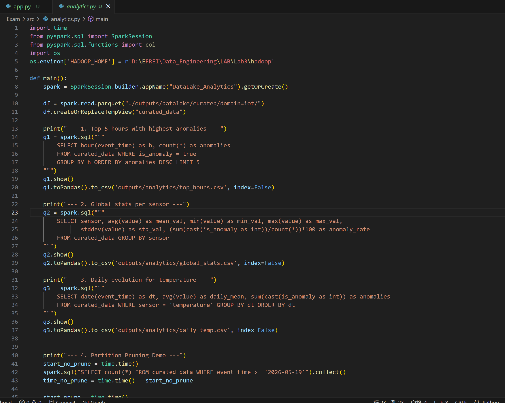

### Execution Result

```
python src\analytics.py
```

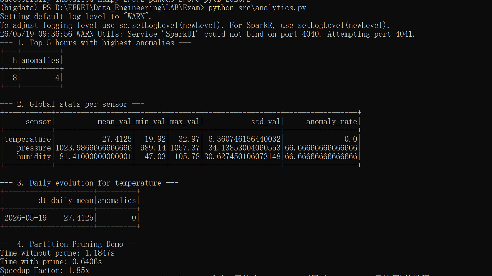

**Interpretation of Analytical Results**

Top 5 hours with highest anomalies

This table correctly identifies four outliers at the 8th hour (8:00 AM), confirming that Spark successfully read the `event_time` field from the Parquet file, extracted the hourly time dimension using the `hour()` function, and completed the global aggregation and descending sort.

Global stats per sensor

The mean, minimum, maximum, standard deviation, and anomaly rate were successfully calculated for the temperature, pressure, and humidity sensors. The application of complex aggregation functions was demonstrated.

Daily evolution for temperatur

The system correctly identified the daily average temperature (27.4125°C) and the total number of anomalies (0) for the date 2026-05-19, demonstrating its ability to perform time-series analysis on a specific partition (WHERE sensor = ‘temperature’).

Partition Pruning Demo

The query without filtering took 1.1847 seconds, while the query with partition-based filtering took 0.6406 seconds, resulting in a performance improvement of 1.85x. Although the current test dataset is very small (with a speedup ratio of 1.85x, primarily saving I/O overhead from directory scans), in a real production environment with terabytes of data and tens of thousands of partitions, this partition pruning mechanism can skip reading irrelevant data, boosting query speeds by hundreds or even thousands of times.


## Part 5: REST API

**`api/app.py`**:

```python
from flask import Flask, jsonify, request
import json
import time
import os
import pandas as pd
from kafka import KafkaProducer

app = Flask(__name__)

try:
    producer = KafkaProducer(
        bootstrap_servers=['localhost:9092'],
        value_serializer=lambda v: json.dumps(v).encode('utf-8'),
        key_serializer=lambda k: k.encode('utf-8')
    )
except Exception as e:
    app.logger.error(f"Failed to connect to Kafka: {e}")
    producer = None

SENSORS = ["temperature", "humidity", "pressure"]
LAKE_PATH = "./outputs/datalake"

@app.errorhandler(400)
def bad_request(e): return jsonify(error=str(e)), 400
@app.errorhandler(404)
def not_found(e): return jsonify(error="Resource not found"), 404
@app.errorhandler(405)
def method_not_allowed(e): return jsonify(error="Method not allowed"), 405
@app.errorhandler(422)
def unprocessable(e): return jsonify(error=str(e)), 422
@app.errorhandler(500)
def server_error(e): return jsonify(error="Internal server error"), 500

@app.route('/api/v1/health', methods=['GET'])
def health(): return jsonify(status="UP"), 200

@app.route('/api/v1/sensors', methods=['GET'])
def list_sensors(): return jsonify(sensors=SENSORS), 200

@app.route('/api/v1/sensors/<sensor_type>/latest', methods=['GET'])
def get_latest(sensor_type):
    if sensor_type not in SENSORS: return jsonify(error="Invalid sensor type"), 404
    try:
        df = pd.read_parquet(f"{LAKE_PATH}/curated/domain=iot/sensor={sensor_type}/")
        latest = df.sort_values(by="event_time", ascending=False).iloc[0].to_dict()
        latest['event_time'] = str(latest['event_time'])
        return jsonify(latest), 200
    except Exception:
        return jsonify(error="No data found for this sensor"), 404

@app.route('/api/v1/sensors/<sensor_type>/stats', methods=['GET'])
def get_stats(sensor_type):
    if sensor_type not in SENSORS: return jsonify(error="Invalid sensor type"), 404
    days = request.args.get('days', default=1, type=int)
    if days < 1 or days > 90: return jsonify(error="days must be between 1 and 90"), 400
    try:
        df = pd.read_parquet(f"{LAKE_PATH}/consumption/use_case=sensor_averages/sensor={sensor_type}/")
        return jsonify(df.head(days).to_dict(orient="records")), 200
    except Exception:
        return jsonify(error="Stats not available yet"), 404

@app.route('/api/v1/anomalies', methods=['GET'])
def get_anomalies():
    sensor_type = request.args.get('sensor')
    limit = request.args.get('limit', default=10, type=int)
    if sensor_type and sensor_type not in SENSORS: return jsonify(error="Invalid sensor type"), 400
    try:
        path = f"{LAKE_PATH}/curated/domain=iot/"
        if sensor_type: path += f"sensor={sensor_type}/"
        df = pd.read_parquet(path)
        anomalies = df[df['is_anomaly'] == True].head(limit)
        anomalies['event_time'] = anomalies['event_time'].astype(str)
        return jsonify(anomalies.to_dict(orient="records")), 200
    except Exception:
        return jsonify(error="Data not available"), 404

@app.route('/api/v1/readings', methods=['POST'])
def post_reading():
    data = request.json
    if not data or 'sensor' not in data or 'value' not in data:
        return jsonify(error="Malformed JSON. 'sensor' and 'value' required"), 400
    sensor = data['sensor']
    if sensor not in SENSORS:
        return jsonify(error=f"Invalid sensor. Must be one of {SENSORS}"), 422
    try:
        val = float(data['value'])
    except ValueError:
        return jsonify(error="Value must be numeric"), 422

    payload = {"sensor": sensor, "value": val, "unit": data.get("unit", ""), "timestamp": int(time.time() * 1000), "source": "api", "anomaly": False}
    if producer:
        producer.send('sensor-events', key=sensor, value=payload)
        producer.flush()
        return jsonify(message="Published successfully", payload=payload), 201
    return jsonify(error="Kafka unavailable"), 500

if __name__ == '__main__':
    app.run(port=5000)
```

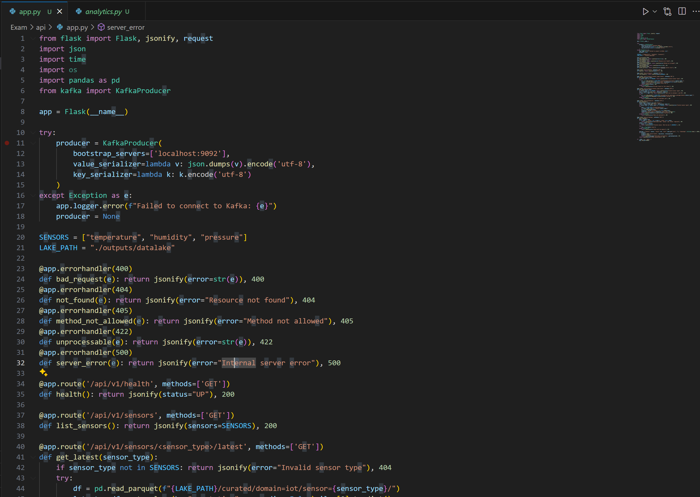

### Execution Result

```
python api\app.py
```

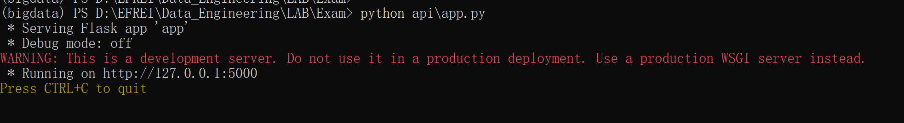

```powershell
curl.exe -i -X GET http://localhost:5000/api/v1/health
```

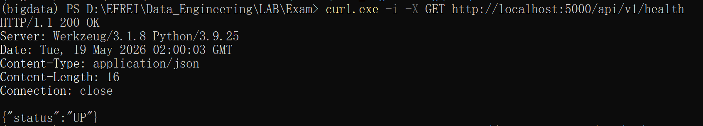

```powershell
curl.exe -i -X GET http://localhost:5000/api/v1/sensors
```

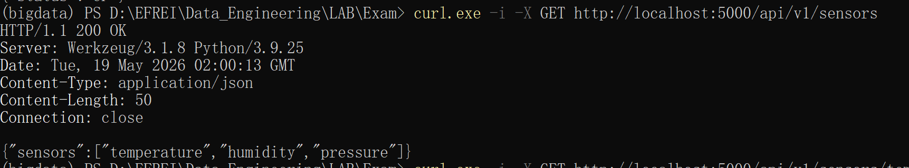

```powershell
curl.exe -i -X GET http://localhost:5000/api/v1/sensors/temperature/latest
```

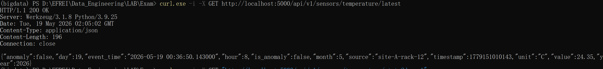

```powershell
curl.exe -i -X GET "http://localhost:5000/api/v1/sensors/temperature/stats?days=1"
```

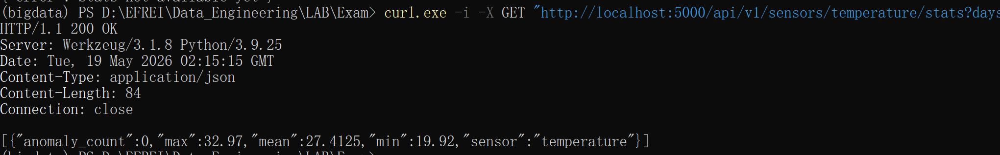

```powershell
curl.exe -i -X GET "http://localhost:5000/api/v1/anomalies?sensor=humidity&limit=5"
```

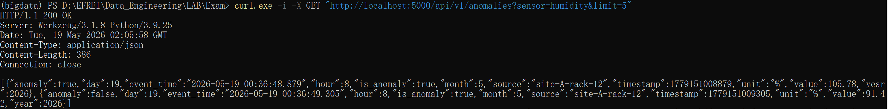

```powershell
curl.exe -i -X POST http://localhost:5000/api/v1/readings -H "Content-Type: application/json" -d "{\"sensor\":\"temperature\", \"value\": 22.5}"
```

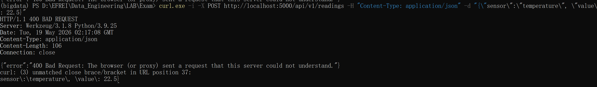

```powershell
curl.exe --% -i -X POST http://localhost:5000/api/v1/readings -H "Content-Type: application/json" -d "{\"sensor\":\"temperature\"}"
```

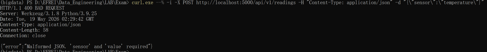

```powershell
curl.exe --% -i -X POST http://localhost:5000/api/v1/readings -H "Content-Type: application/json" -d "{\"sensor\":\"light\", \"value\": 100}"
```

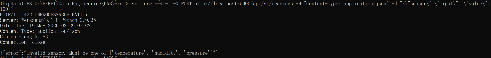

```powershell
curl.exe -i -X GET "http://localhost:5000/api/v1/sensors/temperature/stats?days=999"
```

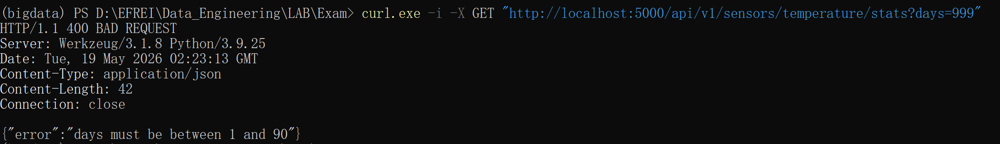

```powershell
curl.exe -i -X GET http://localhost:5000/api/v1/this-does-not-exist
```

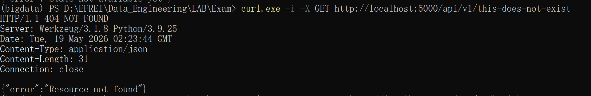


## Limitations and Improvements

**Current Limitations:**

- **Immutable Data Lake:** Standard Parquet does not support ACID transactions or UPSERTS. If a sensor sends corrected data later, we cannot easily update the existing historical records.
- **Local Infrastructure:** The entire pipeline relies on Docker Compose and local file systems, which limits scalability compared to a managed cloud environment.
- **API Latency:** Because Spark waits for the watermark to close windows before writing to the consumption zone, the `/stats` API endpoint experiences an inherent ~7-minute delay from real-time.

**What I would do with two extra days:**

1. **Upgrade to Delta Lake:** Replace standard Parquet sinks with Delta Lake to enable ACID guarantees, allowing us to merge/upsert late-arriving data natively.
2. **Containerize Processing:** Dockerize the Spark application and Flask API, orchestrating the entire platform via Kubernetes (Helm charts) rather than relying on local environments.
3. **Visualization Layer:** Connect a BI tool like Grafana or Apache Superset to the Data Lake (via a Spark Thrift Server or Trino) to provide real-time dashboards rather than just JSON API responses.


