# Lab 1 

## Step 0: Verify Prerequisites

```powershell
conda activate bigdata
cd "D:\EFREI\Data_Engineering"
docker --version
docker compose version
```

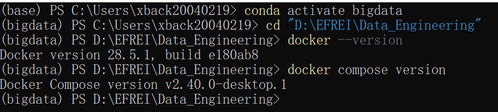

First, navigate to the working directory. Running `docker --version` displays `28.5.1`, and running `docker-compose version` displays `v2.40.0-desktop.1`. This indicates that both Docker Engine and Docker Compose have been installed correctly and meet the course requirements. The environment is now ready.


## Step 1 & 2: Create Directory & Write Compose File

```powershell
mkdir kafka-lab
cd kafka-lab
ni docker-compose.yml
notepad docker-compose.yml
```

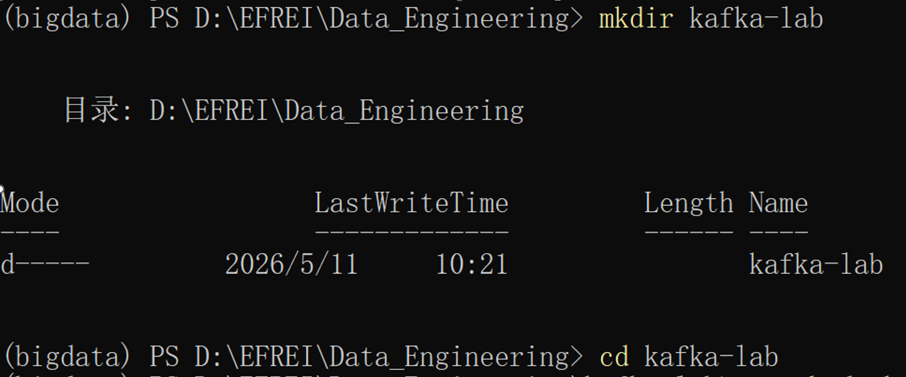

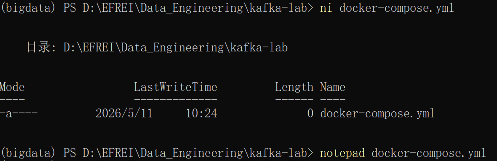

 Using `mkdir`, I successfully created a separate `kafka-lab` folder, which effectively prevents conflicts between Docker volume names and other projects. In Windows PowerShell, the `ni` (New-Item) command successfully created an empty `docker-compose.yml` file. 

 **docker-compose.yml**

I entered the complete cluster configuration, which includes three KRAFT-mode brokers and one Kafka UI, into Notepad. 

```yaml
version: '3.8'
services:
  kafka1:
    image: confluentinc/cp-kafka:7.5.0
    hostname: kafka1
    container_name: kafka1
    ports:
      - "9092:9092"
    environment:
      KAFKA_NODE_ID: 1
      KAFKA_PROCESS_ROLES: 'broker,controller'
      KAFKA_CONTROLLER_QUORUM_VOTERS: '1@kafka1:9093,2@kafka2:9093,3@kafka3:9093'
      KAFKA_LISTENERS: 'PLAINTEXT://kafka1:29092,CONTROLLER://kafka1:9093,EXTERNAL://0.0.0.0:9092'
      KAFKA_ADVERTISED_LISTENERS: 'PLAINTEXT://kafka1:29092,EXTERNAL://localhost:9092'
      KAFKA_LISTENER_SECURITY_PROTOCOL_MAP: 'CONTROLLER:PLAINTEXT,PLAINTEXT:PLAINTEXT,EXTERNAL:PLAINTEXT'
      KAFKA_INTER_BROKER_LISTENER_NAME: PLAINTEXT
      KAFKA_CONTROLLER_LISTENER_NAMES: CONTROLLER
      KAFKA_LOG_DIRS: '/var/lib/kafka/data'
      CLUSTER_ID: 'MkU3OEVBNTcwNTJENDM2Qk'
      KAFKA_OFFSETS_TOPIC_REPLICATION_FACTOR: 3
      KAFKA_DEFAULT_REPLICATION_FACTOR: 3
      KAFKA_MIN_INSYNC_REPLICAS: 2
    volumes:
      - kafka1_data:/var/lib/kafka/data

  kafka2:
    image: confluentinc/cp-kafka:7.5.0
    hostname: kafka2
    container_name: kafka2
    ports:
      - "9094:9094"
    environment:
      KAFKA_NODE_ID: 2
      KAFKA_PROCESS_ROLES: 'broker,controller'
      KAFKA_CONTROLLER_QUORUM_VOTERS: '1@kafka1:9093,2@kafka2:9093,3@kafka3:9093'
      KAFKA_LISTENERS: 'PLAINTEXT://kafka2:29092,CONTROLLER://kafka2:9093,EXTERNAL://0.0.0.0:9094'
      KAFKA_ADVERTISED_LISTENERS: 'PLAINTEXT://kafka2:29092,EXTERNAL://localhost:9094'
      KAFKA_LISTENER_SECURITY_PROTOCOL_MAP: 'CONTROLLER:PLAINTEXT,PLAINTEXT:PLAINTEXT,EXTERNAL:PLAINTEXT'
      KAFKA_INTER_BROKER_LISTENER_NAME: PLAINTEXT
      KAFKA_CONTROLLER_LISTENER_NAMES: CONTROLLER
      KAFKA_LOG_DIRS: '/var/lib/kafka/data'
      CLUSTER_ID: 'MkU3OEVBNTcwNTJENDM2Qk'
      KAFKA_OFFSETS_TOPIC_REPLICATION_FACTOR: 3
      KAFKA_DEFAULT_REPLICATION_FACTOR: 3
      KAFKA_MIN_INSYNC_REPLICAS: 2
    volumes:
      - kafka2_data:/var/lib/kafka/data

  kafka3:
    image: confluentinc/cp-kafka:7.5.0
    hostname: kafka3
    container_name: kafka3
    ports:
      - "9096:9096"
    environment:
      KAFKA_NODE_ID: 3
      KAFKA_PROCESS_ROLES: 'broker,controller'
      KAFKA_CONTROLLER_QUORUM_VOTERS: '1@kafka1:9093,2@kafka2:9093,3@kafka3:9093'
      KAFKA_LISTENERS: 'PLAINTEXT://kafka3:29092,CONTROLLER://kafka3:9093,EXTERNAL://0.0.0.0:9096'
      KAFKA_ADVERTISED_LISTENERS: 'PLAINTEXT://kafka3:29092,EXTERNAL://localhost:9096'
      KAFKA_LISTENER_SECURITY_PROTOCOL_MAP: 'CONTROLLER:PLAINTEXT,PLAINTEXT:PLAINTEXT,EXTERNAL:PLAINTEXT'
      KAFKA_INTER_BROKER_LISTENER_NAME: PLAINTEXT
      KAFKA_CONTROLLER_LISTENER_NAMES: CONTROLLER
      KAFKA_LOG_DIRS: '/var/lib/kafka/data'
      CLUSTER_ID: 'MkU3OEVBNTcwNTJENDM2Qk'
      KAFKA_OFFSETS_TOPIC_REPLICATION_FACTOR: 3
      KAFKA_DEFAULT_REPLICATION_FACTOR: 3
      KAFKA_MIN_INSYNC_REPLICAS: 2
    volumes:
      - kafka3_data:/var/lib/kafka/data

  kafka-ui:
    image: provectuslabs/kafka-ui:latest
    container_name: kafka-ui
    ports:
      - "8080:8080"
    environment:
      KAFKA_CLUSTERS_0_NAME: local-cluster
      KAFKA_CLUSTERS_0_BOOTSTRAPSERVERS: kafka1:29092,kafka2:29092,kafka3:29092
    depends_on:
      - kafka1
      - kafka2
      - kafka3

volumes:
  kafka1_data:
  kafka2_data:
  kafka3_data:
```

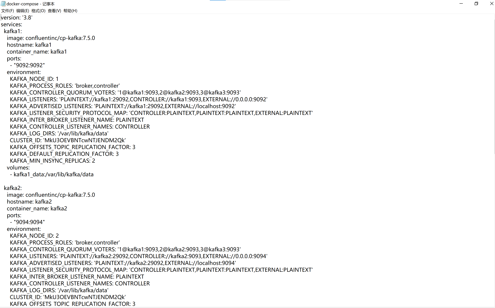


## Step 3: Start the Cluster

```powershell
docker compose up -d
docker compose ps
docker logs kafka1 2>&1 | Select-String "started"
```

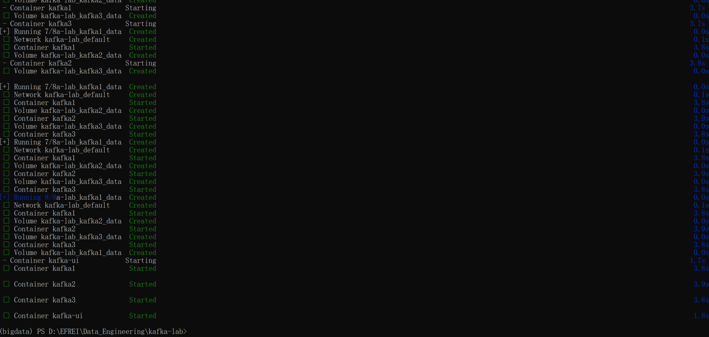

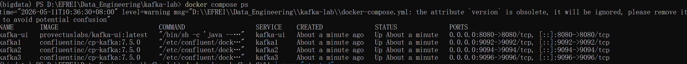

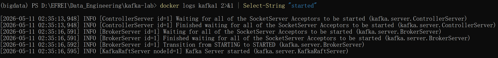

1. The `up -d` command successfully pulled the images, created the network and data volumes, and then started the 4 containers in the background.  

2. The output of `docker compose ps` shows that the STATUS of the four services (`kafka1`, `kafka2`, `kafka3`, and `kafka-ui`) is `Up`, and the port mappings are correct (9092, 9094, 9096).  

3. Filtering `kafka1`'s logs with `Select-String` clearly shows `[KafkaRaftServer nodeId=1] Kafka Server started`, proving that Broker 1 has successfully started as a KRaft node and joined the cluster.  

   


## Step 4 & 5: Connect and Create Topic

```bash
docker exec -it kafka1 bash
kafka-topics --bootstrap-server kafka1:29092 --create --topic session1-events --partitions 3 --replication-factor 3
kafka-topics --bootstrap-server kafka1:29092 --describe --topic session1-events
```

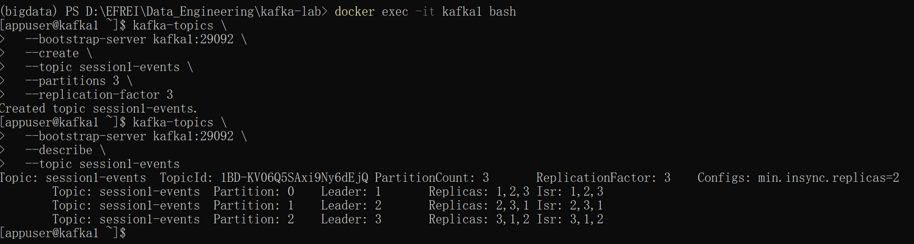

The command successfully created a topic named `session1-events` inside the `kafka1` container.

- The topic is successfully divided into 3 partitions (Partition: 0, 1, 2).  

- `ReplicationFactor: 3` is active; each partition has 3 replicas.  

- **The Leader of Partition 0 is Broker 1**. All replicas `1,2,3` are in the `Isr` (In-Sync Replicas) list, indicating that the current cluster data is fully synchronized and in excellent health.  

  

## Step 6: Produce and Consume Messages

**Terminal 1: Start the Producer**

```bash
kafka-console-producer \
  --bootstrap-server kafka1:29092 \
  --topic session1-events \
  --property "parse.key=true" \
  --property "key.separator=:"
```

```json
user1:{"event":"login", "ts":"2024-01-01T10:00:00Z"}
user2:{"event":"purchase", "item":"laptop", "amount":1299}
user1:{"event":"logout", "ts":"2024-01-01T10:05:00Z"}
```

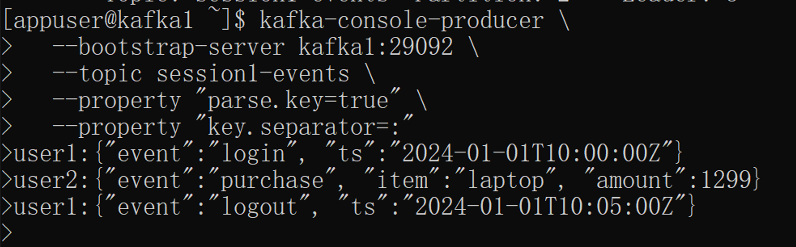

I ran the `kafka-console-producer` command with key parsing enabled (`parse.key=true`) and sent three messages in JSON format. I now understand how to send messages with keys in Kafka. Keys play a crucial role in Kafka’s underlying architecture by determining where data is routed.

**Terminal 2: Start the Consumer**

```bash
kafka-console-consumer \
  --bootstrap-server kafka1:29092 \
  --topic session1-events \
  --from-beginning \
  --property "print.key=true" \
  --property "print.offset=true" \
  --property "print.partition=true"
```

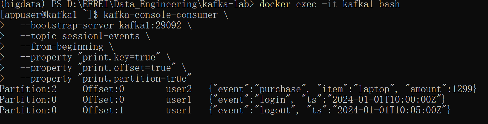

Run `kafka-console-consumer` with the `--from-beginning` option to trace historical messages, and request that the Key, Offset, and Partition be printed. The terminal clearly displays the specific locations of the three messages that were just sent. Both messages with the Key `user1` (`login` and `logout`) landed in Partition 0, and their Offsets strictly increased (one was 0, the other was 1) . Meanwhile, the message with the Key `user2` landed in Partition 2, verifying the Key-based routing mechanism. Kafka guarantees that messages with the same Key will always enter the same Partition. Since a single Partition is internally ordered, this perfectly ensures that user1’s “login” event will always be processed before the “logout” event.

```bash
kafka-console-consumer \
  --bootstrap-server kafka1:29092 \
  --topic session1-events \
  --group analytics-group \
  --from-beginning
```

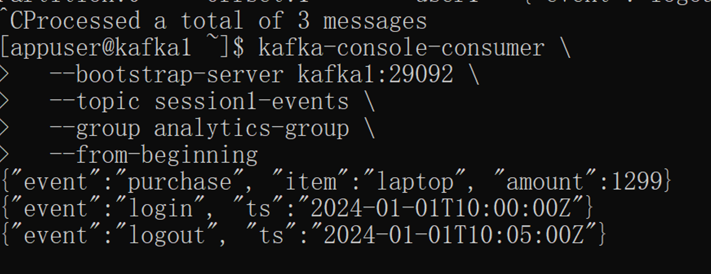

Restart the consumer with the --group analytics-group parameter. The terminal displayed these messages again, but this time the consumer was reading data as a member of the analytics-group logical group.

**Terminal 3 - Check Consumer Group Lag**

```bash
docker exec -it kafka1 bash
kafka-consumer-groups \
  --bootstrap-server kafka1:29092 \
  --describe \
  --group analytics-group
```

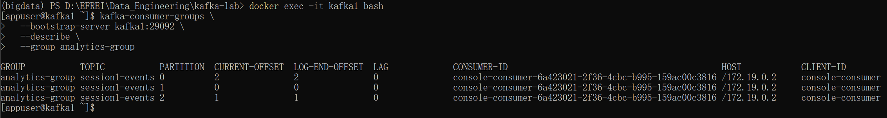

Run `kafka-consumer-groups --describe` to view the status of the `analytics-group`. A status table is displayed. Focus on the `LAG` column: all three partitions show a value of 0; furthermore, the numbers for `CURRENT-OFFSET` (the current read position) and `LOG-END-OFFSET` (the total log length) are exactly the same. You have now mastered a critically important monitoring metric in a production environment: Lag (backlog). A Lag of 0 means your consumers are keeping up with the producer’s send rate, and there is no data backlog. If this number continues to increase, it indicates that your consumers are stalling or lack sufficient processing power, and you need to scale out by adding nodes.


## Step 7: Fault Tolerance - Simulate Failure

**Terminal 3**

```bash
docker stop kafka1
```

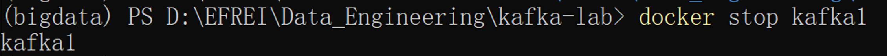

**Terminal 2: Check inside container**

```bash
docker exec -it kafka2 bash
kafka-topics --bootstrap-server kafka2:29092 --describe --topic session1-events
```

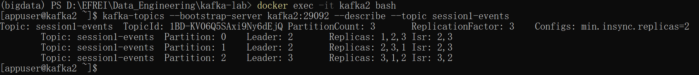

Enter the running Kafka2 container and run `--describe` to view the topic status. When we created it in Step 5, the Leader for Partition 0 was 1. As shown in the screenshot, the Leader has now automatically changed to 2 (or 3). Additionally, in the Isr (In-Sync Replicas) column on the far right, node 1 has disappeared, leaving only 2 and 3. This confirms the Leader Re-election mechanism. When the primary node fails, Kafka’s Controller instantly promotes a secondary node from the Isr list to become the new Leader, taking over read and write requests.

```bash
kafka-console-consumer \
  --bootstrap-server kafka2:29092 \
  --topic session1-events \
  --from-beginning
```

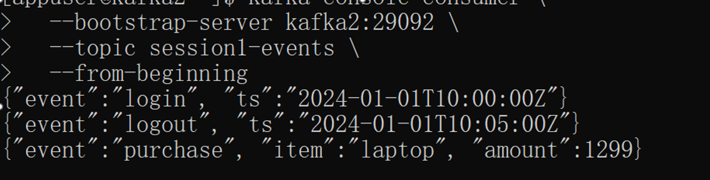

Still connected to kafka2, I attempted to consume the “session1-events” stream from the beginning. Even though Broker 1 had crashed, the terminal still printed out all historical messages for user1 and user2 perfectly and completely, without missing a single one. This demonstrated the power of replication. Because the replication factor was set to 3, the data was securely stored in redundant copies across multiple machines. Even with a node failure, the system still provided 100% availability and data integrity.

```bash
docker start kafka1
```

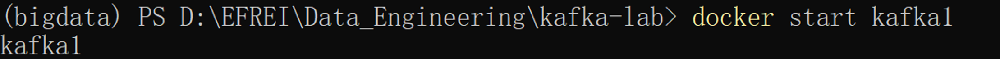

```bash
kafka-topics --bootstrap-server kafka2:29092 --describe --topic session1-events
```

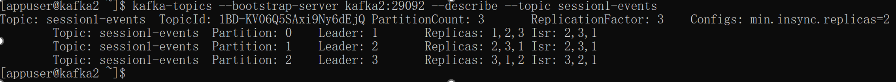

Run `docker start kafka1`, then use `--describe` again to check the status. Looking at the latest topic status table, you’ll see that Node 1 has reappeared in the ISR list for all partitions (now showing something like 2,3,1). This demonstrates how nodes automatically rejoin and synchronize. Once a Kafka node comes back online, no manual intervention is required to copy data. It automatically locates the current Leader, fetches all messages missed during the downtime, and, once the data is fully synchronized, automatically rejoins the ISR synchronization list, bringing the cluster back to full health.


## Step 8: Explore Kafka UI

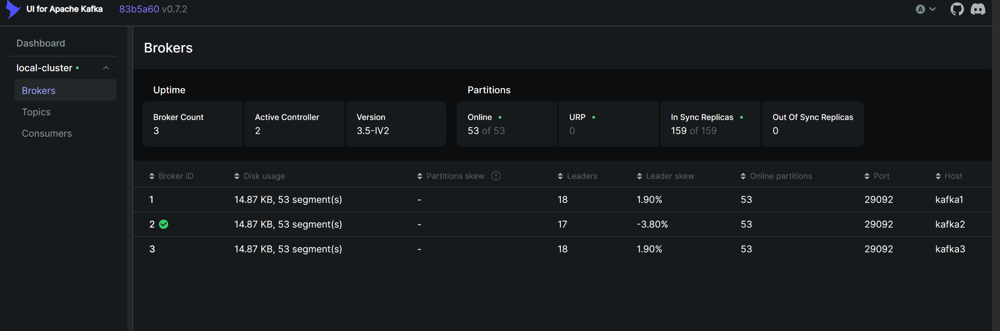

By accessing the Kafka UI via the browser, you intuitively see the cluster's health dashboard. The interface clearly shows 3 Brokers online, with the Active Controller being Broker 2. The right panel shows `In Sync Replicas` at 159, because besides our created topic, there are Kafka internal topics, and `Out Of Sync Replicas` at 0. This confirms that the cluster, having just gone through the crash test, has fully recovered to a 100% healthy state.  


## Step 9: Teardown

```powershell
docker compose down
docker compose down -v
```

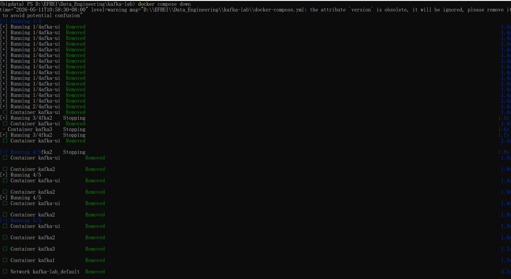

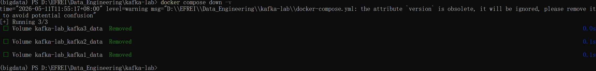

After executing this command, Docker sequentially stopped (`Stopping`) and removed (`Removed`) all 4 containers and the network `kafka-lab_default` created for them. 