# Lab2-Report


## Step 0: Environment Setup

### 0a: Start the Kafka Cluster

To start the Kafka cluster environment that was configured in the previous session.

```bash
cd kafka-lab
docker compose up -d
docker compose ps
```

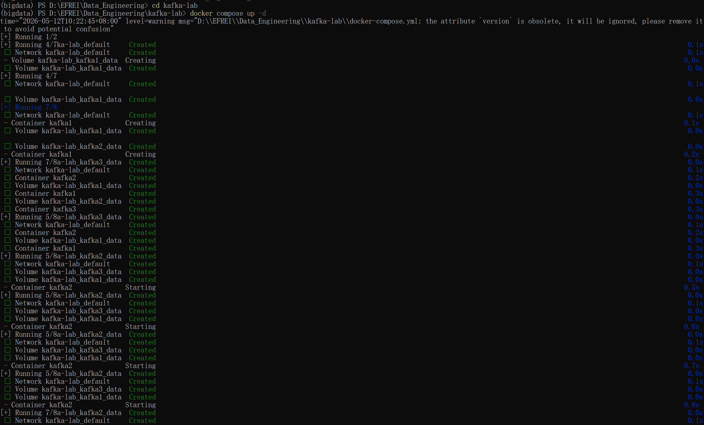

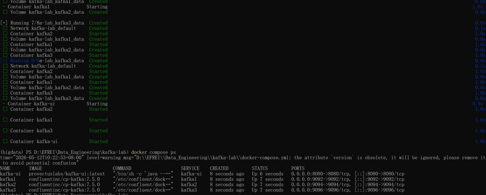

### 0b: Create a Virtual Environment and Install the Library

**Since I initially operated in a virtual environment, I can skip creating the virtual environment and directly install kafka-python-ng using pip.**

```bash
pip install kafka-python-ng
```

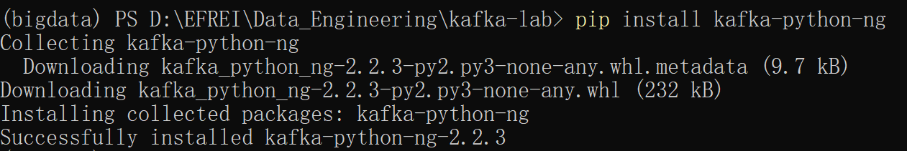

### 0c: Create the Topic for This Lab

To create a new topic specifically designed for simulating IoT sensor events in this lab.

```bash
docker exec -it kafka1 bash
kafka-topics --bootstrap-server kafka1:29092 \
  --create \
  --topic sensor-events \
  --partitions 3 \
  --replication-factor 3

kafka-topics --bootstrap-server kafka1:29092 \
  --describe --topic sensor-events
```

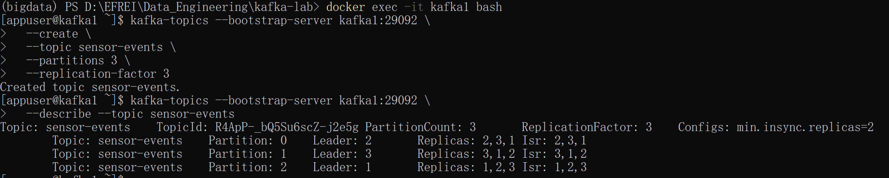

The script accesses the `kafka1` container and uses the CLI to create a topic named `sensor-events` with 3 partitions and a replication factor of 3. It then describes the topic to confirm its creation.


## Step 1: Write the Producer

### 1a: Imports and Configuration

Create a Python file named producer using VS Code.

To import the required libraries and define the fundamental tools for the producer script.

```python
from kafka import KafkaProducer
import json
import time
import random
```

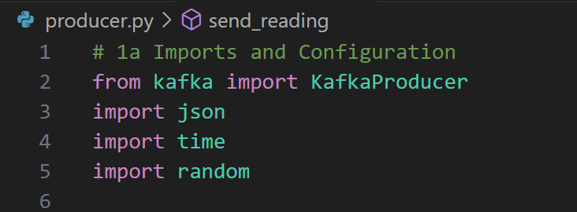

### 1b: Instantiate the Producer with Reliability Settings


To configure the `KafkaProducer` instance with specific settings targeting high durability and optimal throughput.

```python
producer = KafkaProducer(
    bootstrap_servers=['localhost:9092', 'localhost:9094', 'localhost:9096'],
    acks='all',
    retries=5,
    max_in_flight_requests_per_connection=1,
    value_serializer=lambda v: json.dumps(v).encode('utf-8'),
    key_serializer=lambda k: k.encode('utf-8'),
    linger_ms=10,
    batch_size=32768,
)

```

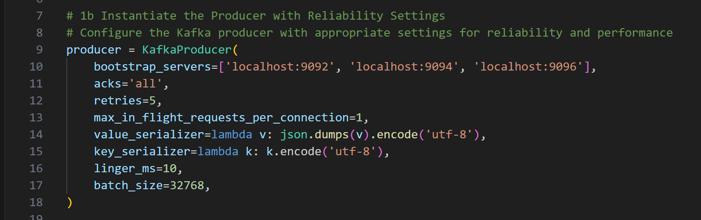

 Because the `kafka-python-ng` library does not support the `enable_idempotence` parameter natively, we must rely on `acks='all'` and `retries=5` to achieve robust at-least-once delivery guarantees.

### 1c: The Sending Loop

To continuously generate and send mock sensor data to the Kafka topic while handling acknowledgments gracefully.

```python
SENSOR_TYPES = ['temperature', 'humidity', 'pressure']
TOPIC = 'sensor-events'

def send_reading(sensor_type, value):
    record = {
        'sensor': sensor_type,
        'value': value,
        'unit': {'temperature': 'C', 'humidity': '%', 'pressure': 'hPa'}[sensor_type],
        'timestamp': int(time.time() * 1000),
    }
    future = producer.send(
        topic=TOPIC,
        key=sensor_type,
        value=record,
    )
    return future

try:
    for i in range(50):
        sensor = random.choice(SENSOR_TYPES)
        value = round(random.uniform(10, 40), 2)
        future = send_reading(sensor, value)

        # Block until broker confirms receipt
        metadata = future.get(timeout=10)
        print(f"Sent to partition {metadata.partition}, offset {metadata.offset}")
        time.sleep(0.2)
finally:
    producer.flush() # send any remaining buffered records
    producer.close()
    print("Producer closed.")

```

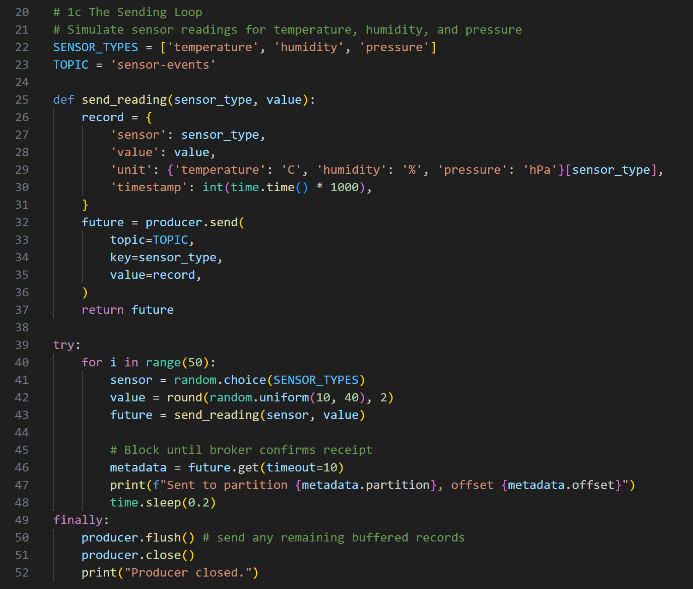

The code defines an array of sensor types and loops 50 times to generate random readings. `producer.send()` is asynchronous, returning a Future object immediately. The `.get(timeout=10)` method blocks the execution until the broker acknowledges the write. The `finally` block ensures that `producer.flush()` drains the internal buffer so no records are lost before the script exits.
Passing `key=sensor_type` ensures that all readings from a specific sensor type will consistently land on the exact same partition. This mechanism guarantees that a downstream consumer reading temperature data will observe the events in chronological order.


## Step 2: Write the Consumer

### 2a: Imports and Configuration

Create a Python file named consumer using VS Code.


To import tools necessary for subscribing to topics, fetching records, and manually assigning partitions.

```python
from kafka import KafkaConsumer, TopicPartition
import json
```


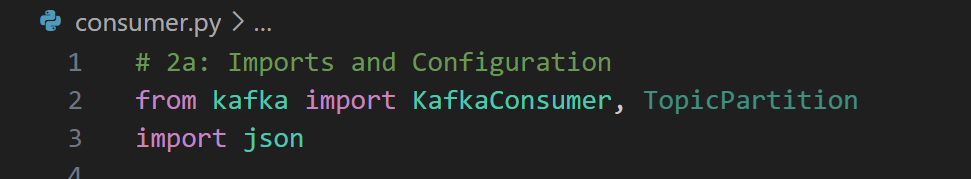

### 2b: Instantiate the Consumer


To initialize the consumer with settings designed for manual offset control and consumer group scaling.

```python
consumer = KafkaConsumer(
    'sensor-events',
    bootstrap_servers=['localhost:9092', 'localhost:9094', 'localhost:9096'],
    group_id='sensor-analytics',
    auto_offset_reset='earliest',
    enable_auto_commit=False,
    value_deserializer=lambda b: json.loads(b.decode('utf-8')),
    key_deserializer=lambda b: b.decode('utf-8') if b else None,
    max_poll_records=10,
    session_timeout_ms=45000,
    heartbeat_interval_ms=15000,
)
```

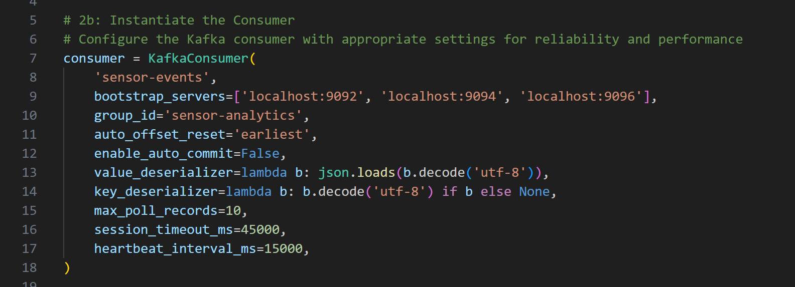

Setting `enable_auto_commit=False` is critical for achieving "at-least-once" delivery semantics by shifting the commit responsibility to the application layer.

### 2c: The Processing Loop with Manual Commit

To continuously poll for new messages, process them (e.g., alert on high temperatures), and manually commit offsets.

```python
print("Consumer started. Waiting for messages...")
try:
    for message in consumer:
        record = message.value
        key = message.key
        part = message.partition
        offset = message.offset

        # Business logic
        print(f"[P{part}|O{offset}] sensor={key} value={record['value']}{record['unit']}")

        if record['sensor'] == 'temperature' and record['value'] > 35:
            print(f"  >>> ALERT: high temperature {record['value']} C!")

        # Commit AFTER processing
        consumer.commit()
except KeyboardInterrupt:
    print("Stopping consumer...")
finally:
    consumer.close()
    print("Consumer closed.")
```

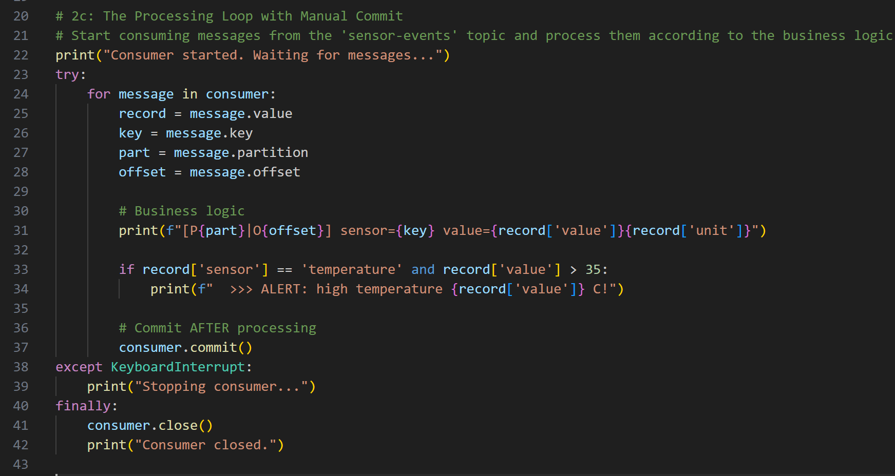

The `for message in consumer:` line internally calls `poll()` and yields individual records. The `consumer.commit()` function is invoked only *after* the record is fully processed and printed.
Because we commit the offset after processing, this implements an at-least-once pattern. If the application crashes between processing the message and issuing the commit command, the message will be replayed upon restart.


## Step 3: Run the Pipeline End-to-End

### 3a: Start the Consumer First

To have the consumer actively listening before messages are produced, allowing real-time observation.

```bash
# Terminal 1
python consumer.py
```

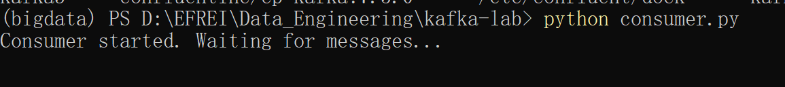

Starting the consumer first ensures no messages are missed in real-time observation.

### 3b: Start the Producer


To inject 50 generated messages into the Kafka topic.

```bash
# Terminal 2
python producer.py
```

The producer runs its 50-iteration loop, sending data to the cluster.

Terminal 2

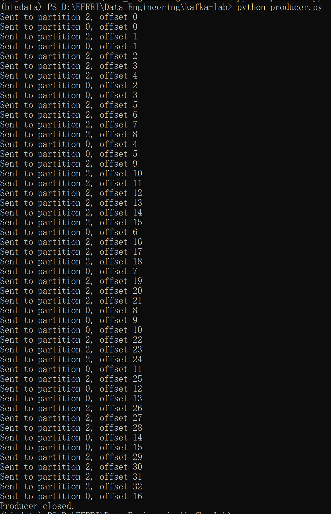

Terminal 1

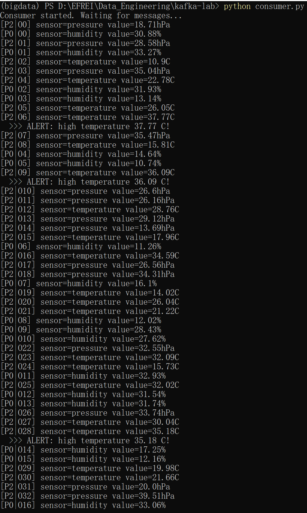

Terminal 2 shows "Sent to partition X, offset Y". Simultaneously, Terminal 1 prints the processed records and high-temperature alerts. By observing the output in Terminal 1, it can verify that all temperature readings land on the identical partition, all humidity readings land on another identical partition, and offsets strictly increase. Temperature values above 35°C trigger the alert message.


## Step 4: Consumer Group Scaling Exercise

### 4a: Start a Second Consumer Instance


To observe how Kafka scales consumption by distributing partitions among multiple consumers in the same group.

```bash
# Terminal 3 (same consumer.py, same group_id)
python consumer.py
```

Run producer.py again

```bash
# Terminal 2
python producer.py
```

Terminal 1

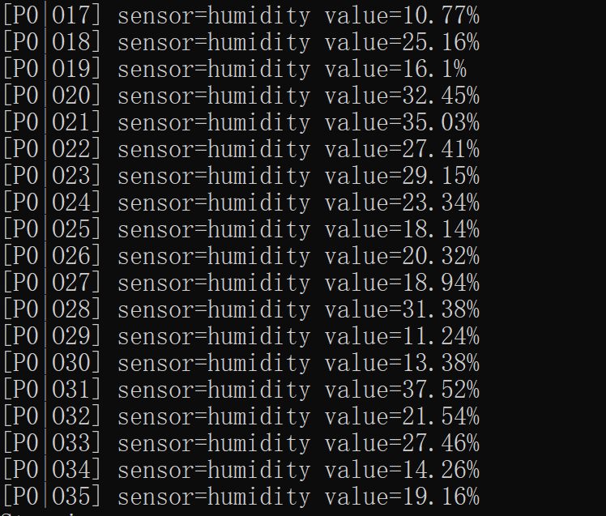

Terminal 3

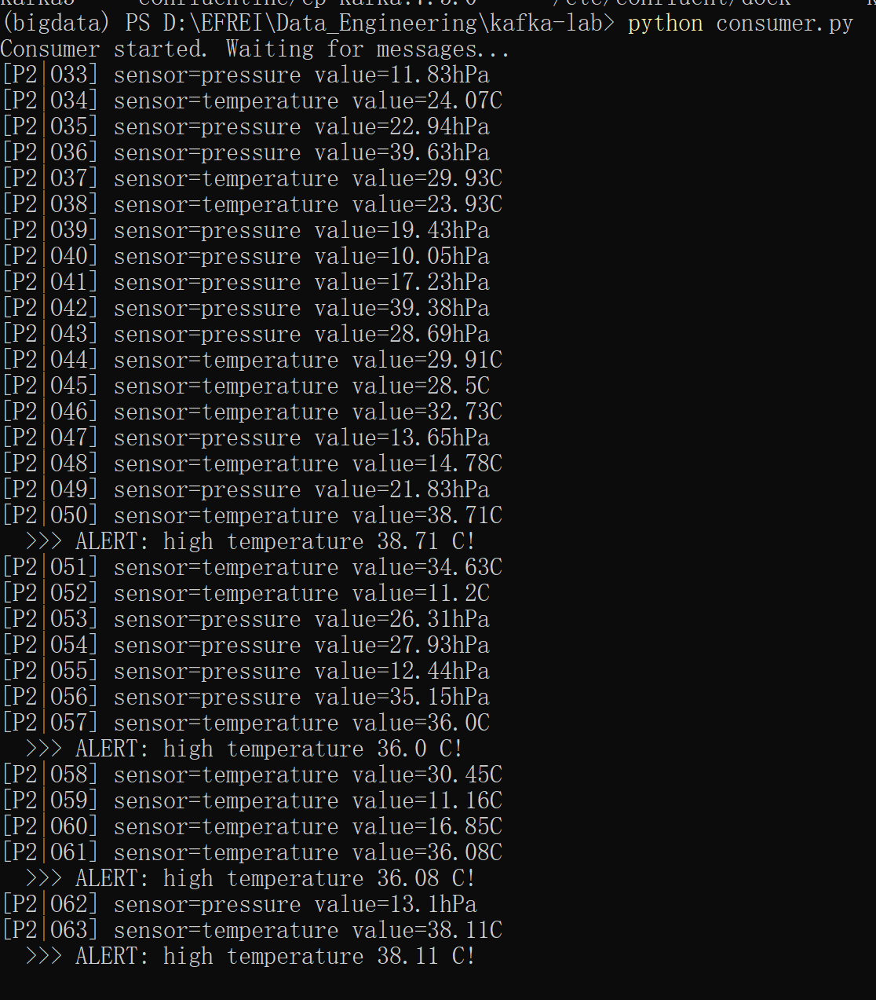

Terminal 1 and Terminal 3 begin to share the incoming traffic. Each terminal only prints messages from its specially assigned partition. Kafka triggers a rebalance and redistributes the 3 partitions across the 2 active consumers, ensuring each partition is exclusively read by one consumer.

**Why isn't P1 included?**

**The hash calculation and modulo 3 for the words "pressure" and "temperature" both result in 2. They are both crammed into partition P2.**

### 4b: Check Partition Assignment


 To programmatically verify which partitions are assigned to which consumer.

(Add to `consumer.py` right before the main processing loop)

```python
# Force a poll to trigger partition assignment
consumer.poll(timeout_ms=1000)
assigned = consumer.assignment()
print(f"Assigned partitions: {[f'P{p.partition}' for p in assigned]}")
```

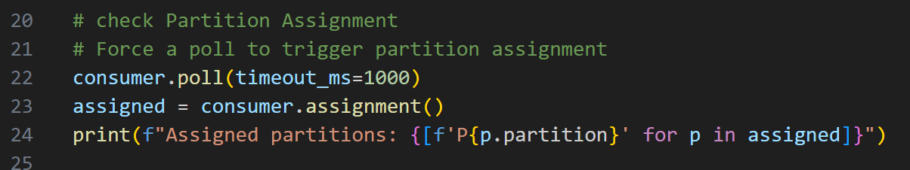

`consumer.poll()` is forced to trigger the initial communication with the broker. `consumer.assignment()` fetches the set of assigned `TopicPartition` objects.

Terminal 1

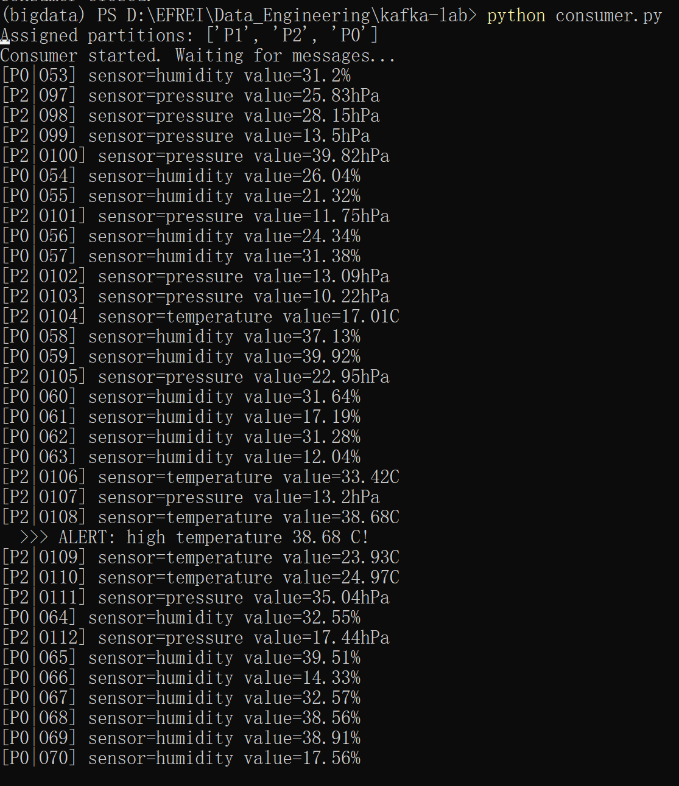

Terminal 3

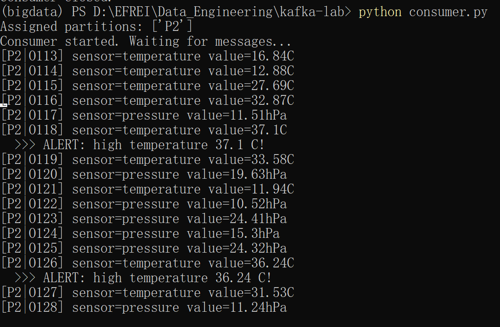

First, run Terminal 1. At the beginning of the terminal, you can see that it includes all the partitions. While running Terminal 1, open Terminal 3. You will find that only the p0 partition is generated after Terminal 1, while Terminal 3 generates another partition, p2.

### 4c: Observe the Rebalance on Consumer Exit


To see how Kafka handles a consumer leaving the group.

Press `Ctrl+C` in Terminal 3.

Terminal 3

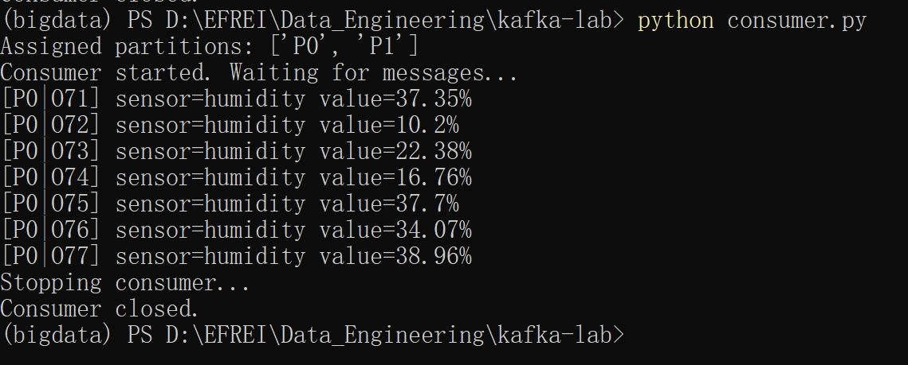

Terminal 1

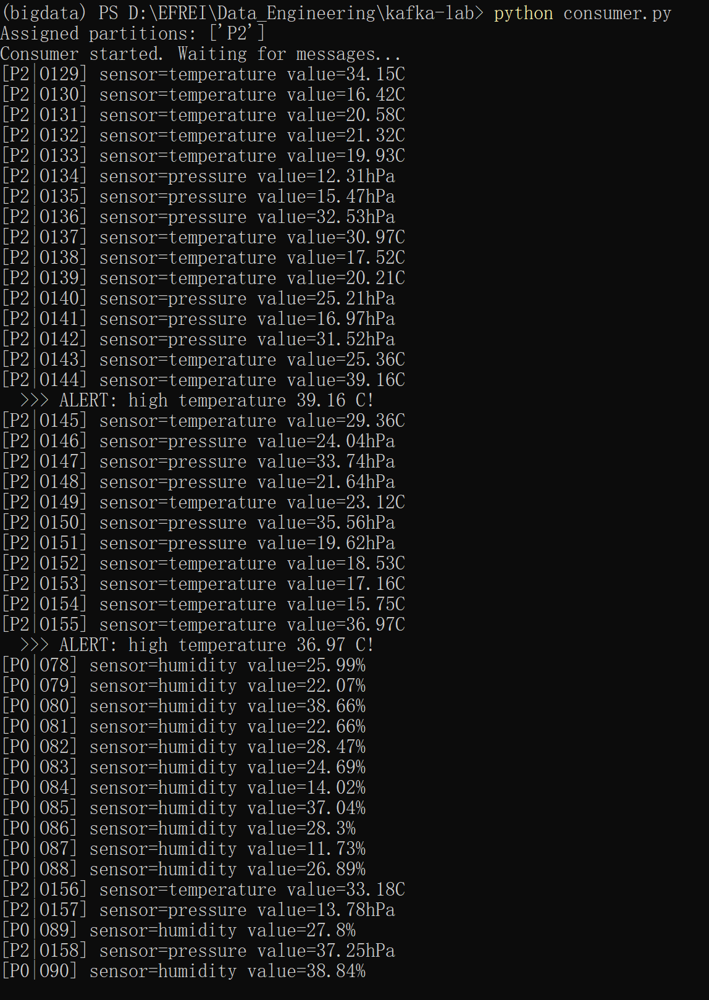

Initially, both terminals were working, each responsible for its own partitions. When I disconnected terminal 3, Kafka declared terminal 3 dead and triggered a new rebalancing, forcibly assigning tasks originally belonging to terminal 3 to the only surviving terminal 1. Terminal 1 then began generating all partitions.


## Step 5: Fault Injection: Crash and Replay

### 5a: Produce More Messages

To populate the topic with a fresh batch of data to test fault tolerance.

```bash
python producer.py
```

### 5b: Crash the Consumer Mid-Processing

To simulate a sudden application failure before offsets can be manually committed.

```bash
python consumer.py
# Let it print 3-4 messages, then press Ctrl+C quickly
```

### 5c: Restart and Observe Replay


To verify that uncommitted messages are safely re-delivered.

```bash
python consumer.py
```

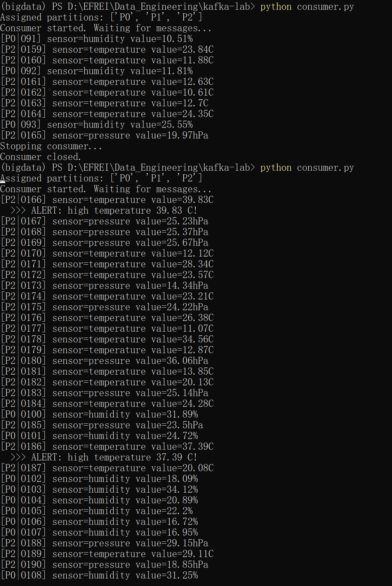

The time difference between the two operations is less than 1 millisecond. By the time you see it print 3 to 4 lines of messages, and your brain tells your finger to press Ctrl + C, the code has already finished executing the `consumer.commit()` calls for those messages. The offset has been successfully saved to Kafka, so when it restarts, it will naturally continue reading the next new message, and we don't see a replay.


## Step 6: Monitor Consumer Lag in Kafka UI

Open http://localhost:8080 and navigate to Consumer Groups → sensor-analytics.

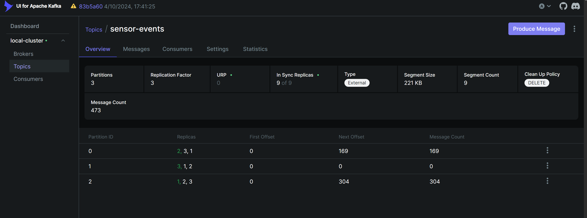

To understand how to monitor the health of the streaming pipeline visually.

1. Stop all consumers.
2. Run `python producer.py` twice to send 100 messages.
3. Open `http://localhost:8080`, go to Consumer Groups -> `sensor-analytics`.

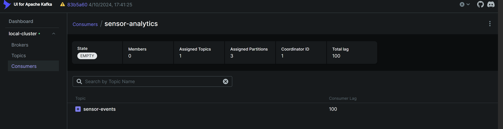

4. Restart the consumer and watch the UI.

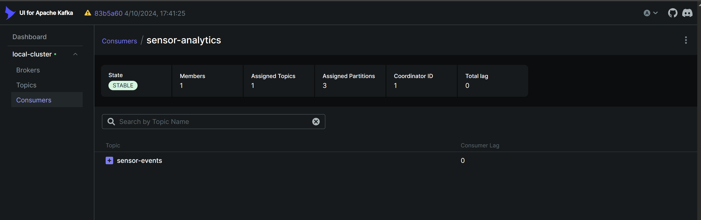

 In the UI, the `LAG` column read 100. Once the consumer is restarted in the terminal, the `LAG` value visibly drop to 0.


## Reflection Questions

**1. You used `key=sensor_type` in the producer. What would happen to message ordering if you had used `key=None` instead?**
If `key=None` was used, Kafka would rely on round-robin routing to distribute the messages evenly across all available partitions to maximize throughput. Consequently, readings from the same sensor (e.g., 'temperature') would be scattered across multiple partitions. Since Kafka only guarantees strict ordering within a single partition, the consumer would lose the chronological ordering of the temperature readings.

**2. With `enable.auto.commit=False`, what are the exact conditions under which a message could be processed twice? What about zero times?**

**Processed Twice (Duplicates):** If the application successfully processes a message (e.g., updates a database) but crashes before the `consumer.commit()` command executes, the offset remains uncommitted. Upon restart, the consumer will resume from the last known committed offset and replay the message, resulting in it being processed a second time. This is "at-least-once" delivery.

**Processed Zero Times (Loss):** If the code is structured to call `consumer.commit()` *before* the business logic processing occurs, and the application crashes immediately after the commit but before the processing is complete, the message is permanently skipped. Upon restart, the consumer will read the next offset, meaning the message was processed zero times. This represents "at-most-once" delivery.

**3. You have a topic with 6 partitions and a consumer group with 8 consumers. How many consumers are idle? What is the maximum number of consumers that can usefully process this topic in parallel?**
Kafka guarantees that each partition is assigned to at most one consumer within the same consumer group. Therefore, if there are 6 partitions and 8 consumers, 2 consumers will remain idle without any partitions assigned to them. The maximum number of consumers that can usefully process this topic in parallel is strictly equal to the number of partitions, which is 6.

**4. Explain the difference between `auto.offset.reset=earliest` and `auto.offset.reset=latest`. In which situations would you choose each?**

`auto.offset.reset=earliest`: When the consumer group connects and finds no committed offset, it starts reading from the very first available message in the partition log. You choose this when you want to replay historical data, such as bootstrapping a new database, training a model on past events, or recalculating an aggregate from scratch.

`auto.offset.reset=latest`: When no committed offset exists, the consumer skips all historical messages and only processes new records that arrive after it starts. You choose this for real-time monitoring, live dashboards, or temporary alerting systems where old data is irrelevant to the current operational state.

**5. Your producer's throughput is 10000 messages/second but the broker is only acknowledging 2000/second. Which producer parameters would you adjust to improve throughput while keeping `acks=all`?**

**Increase `linger.ms` **: This forces the producer to pause briefly before sending, allowing more messages to accumulate in the memory buffer.

**Increase `batch.size`**: This raises the maximum byte size of the payload sent per partition (e.g., moving from the default 16384 up to 65536 or 131072).