# Lab3 Report

### Kafka + Spark Structured Streaming ETL Pipeline


## **Step 0: Environment Setup**

### **0a Start the Kafka Cluster**

Initializes the local Kafka environment containing the brokers required for the source data.  

```bash
docker compose up -d
docker compose ps
docker exec kafka1 kafka-topics --bootstrap-server kafka1:29092 --list
```

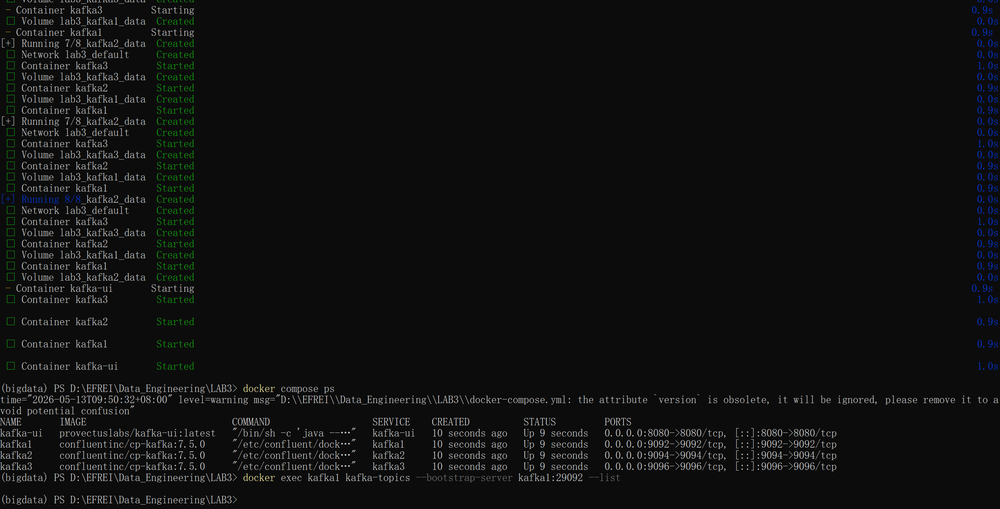

### **0b Install Python Dependencies**

This prepares the Python virtual environment with the necessary libraries (PySpark and Kafka Python client) to run the ETL pipeline.  I'm already in the virtual environment, so I don't need to activate it.

```bash
pip install pyspark==3.5.3 kafka-python-ng
```

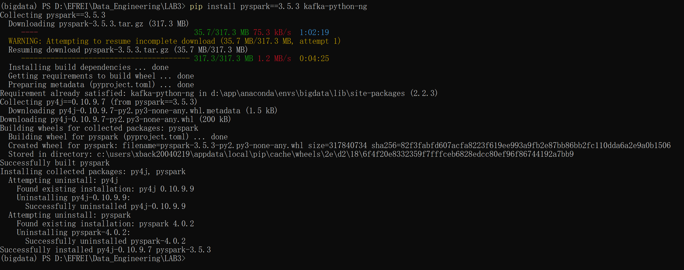

### **0c Create Output Directory**

Creates the local file system directories where the pipeline will store its final Parquet output files and its operational streaming state (checkpoint).  

```bash
mkdir spark-etl\output
mkdir spark-etl\checkpoint
```

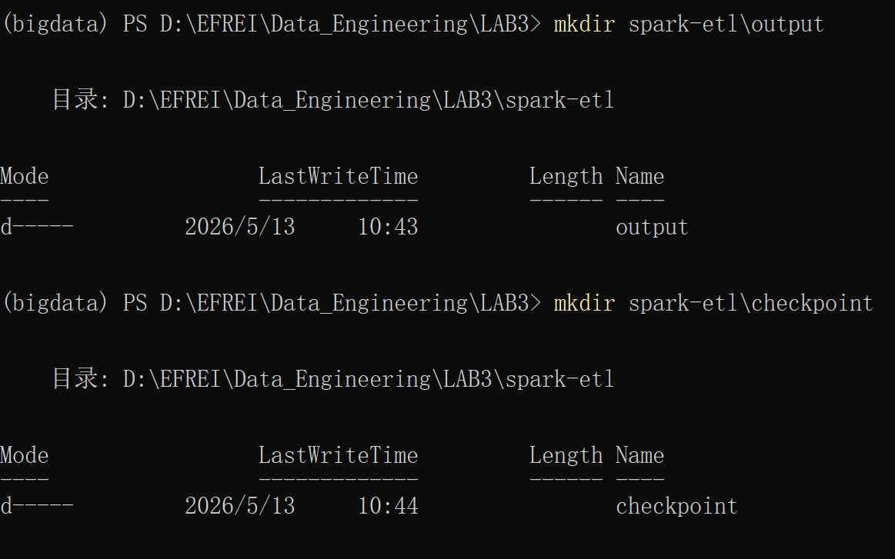

 Establishing a dedicated checkpoint directory is crucial; without it, a restarted Spark job cannot resume properly and would reprocess data from the beginning.  


## **Step 1: Create the Spark Session**

### **1a Imports**

Create a file etl_pipeline.py in vscode.

Imports all required classes, functions, and data types from the PySpark library to build the pipeline.  

```python
from pyspark.sql import SparkSession
from pyspark.sql.functions import col, from_json, avg, window, to_timestamp, expr, lit
from pyspark.sql.types import StructType, StructField, StringType, DoubleType, LongType
```

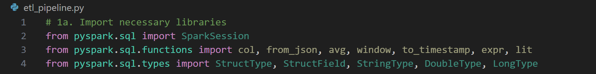

### **1b Build the SparkSession**

Initializes the Spark application, configures it to run locally, and tells it to download the necessary Kafka connector JARs.  

```python
spark = SparkSession.builder \
    .appName("SessionETLPipeline") \
    .master("local[*]") \
    .config("spark.jars.packages", "org.apache.spark:spark-sql-kafka-0-10_2.12:3.5.3") \
    .config("spark.sql.shuffle.partitions", "3") \
    .config("spark.streaming.stopGracefullyOnShutdown", "true") \
    .getOrCreate()

spark.sparkContext.setLogLevel("WARN")
```

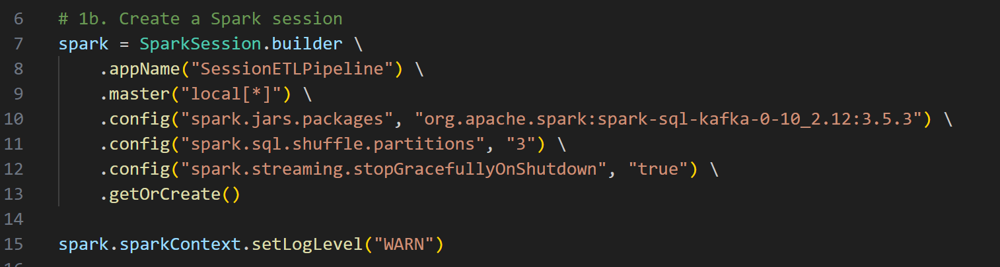


## **Step 2: Read the Raw Kafka Stream**

### **Read the Raw Kafka Stream**

Connects Spark to the Kafka cluster to continuously read events from the `sensor-events` topic starting from the earliest offset.  

```python
KAFKA_BROKERS = "localhost:9092,localhost:9094,localhost:9096"
TOPIC = "sensor-events"

raw_stream = spark.readStream \
    .format("kafka") \
    .option("kafka.bootstrap.servers", KAFKA_BROKERS) \
    .option("subscribe", TOPIC) \
    .option("startingOffsets", "earliest") \
    .option("failOnDataLoss", "false") \
    .load()

raw_stream.printSchema()
```

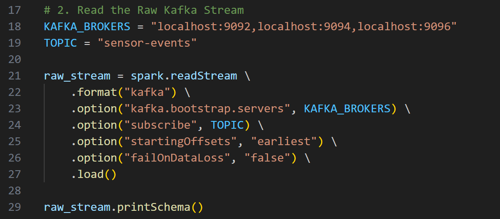


## **Step 3: Parse the JSON Payload**

### **3a Define the Expected Schema**

Explicitly defines the structure and data types of the JSON payload arriving from Kafka.  

```python
sensor_schema = StructType([
    StructField("sensor", StringType(), nullable=False),
    StructField("value", DoubleType(), nullable=False),
    StructField("unit", StringType(), nullable=True),
    StructField("timestamp", LongType(), nullable=False),
    StructField("source", StringType(), nullable=True),
])
```

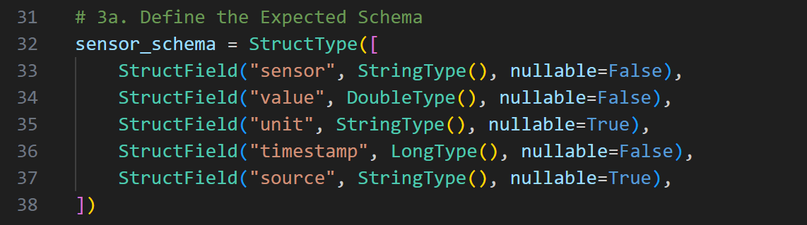

### **3b Cast and Parse**

Casts the raw binary Kafka payload to a string, parses it into a structured format using the schema, and extracts the time into a Spark-compatible timestamp.  

```python
parsed_stream = raw_stream \
    .select(
        col("key").cast("string").alias("message_key"),
        from_json(col("value").cast("string"), sensor_schema).alias("data"),
        col("partition"),
        col("offset"),
        col("timestamp").alias("kafka_timestamp")
    ) \
    .select(
        col("message_key"),
        col("data.sensor"),
        col("data.value"),
        col("data.unit"),
        to_timestamp(expr("data.timestamp / 1000")).alias("event_time"),
        col("partition"),
        col("offset")
    )
```

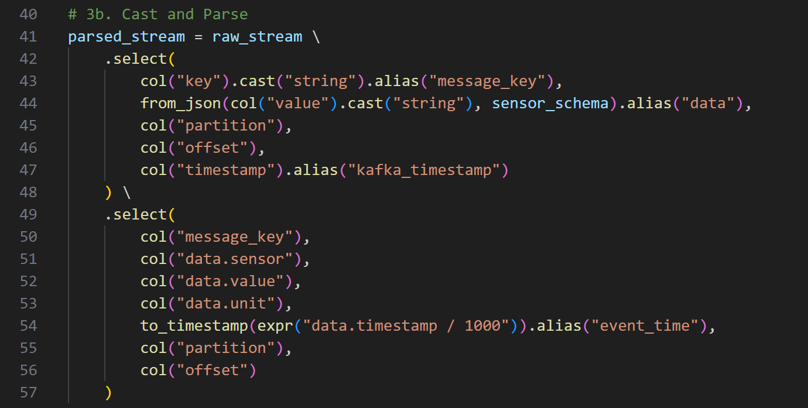


## **Step 4: Apply Business Logic: Filter and Alert**

### **Apply Business Logic**

Cleans the data by dropping bad records (nulls) and flags sensor readings that exceed predefined safety thresholds.  

```python
# 4a: Filter out null records
clean_stream = parsed_stream \
    .filter(col("sensor").isNotNull()) \
    .filter(col("value").isNotNull())

# 4b: Flag anomalies
TEMP_THRESHOLD = 35.0
HUM_THRESHOLD = 90.0

flagged_stream = clean_stream.withColumn(
    "is_anomaly",
    (
        ((col("sensor") == "temperature") & (col("value") > TEMP_THRESHOLD)) |
        ((col("sensor") == "humidity") & (col("value") > HUM_THRESHOLD))
    )
)
```

`withColumn` adds a boolean column without materializing anything immediately; it adds a node to the lazy evaluation DAG.  

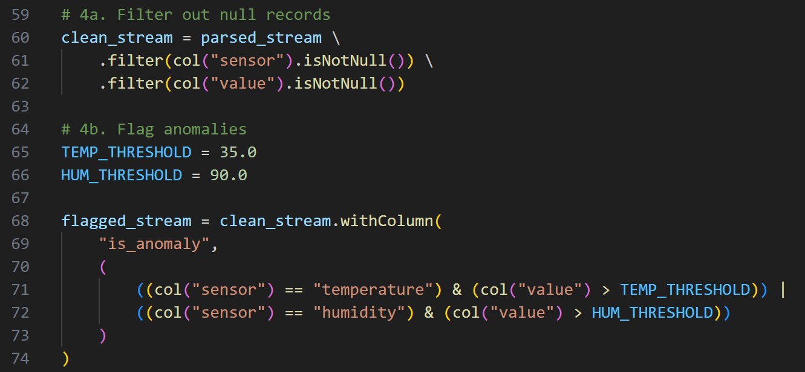


## **Step 5: Windowed Aggregation**

### **Windowed Aggregation**

Groups the incoming stream into 5-minute time buckets based on the actual event time, calculates the average value, and applies a watermark to handle late-arriving data.  

```python
# 5a: Add watermark
watermarked = flagged_stream \
    .withWatermark("event_time", "2 minutes")

# 5b: Group by 5-minute window
windowed_avg = watermarked \
    .groupBy(
        window(col("event_time"), "5 minutes"),
        col("sensor")
    ) \
    .agg(
        avg(col("value")).alias("avg_value")
    )
```

The watermark of "2 minutes" drops events arriving more than 2 minutes behind the latest seen event time, allowing Spark to close windows and free memory. 

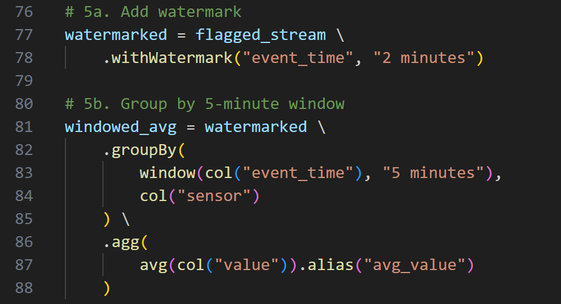


## **Step 6: Write to Parquet Sink**

### **6a Write the Aggregated Stream**

Starts the streaming query, continuously writing the updated 5-minute averages into a Parquet directory every 10 seconds.  

```python
OUTPUT_PATH = "./spark-etl/output"
CHECKPOINT_PATH = "./spark-etl/checkpoint"

query = windowed_avg \
    .writeStream \
    .outputMode("append") \
    .format("parquet") \
    .option("path", OUTPUT_PATH) \
    .option("checkpointLocation", CHECKPOINT_PATH) \
    .trigger(processingTime="10 seconds") \
    .start()
```

`outputMode("update")` writes only rows whose aggregated value changed.  

The checkpoint tracks offsets and state to prevent reprocessing upon restart .  

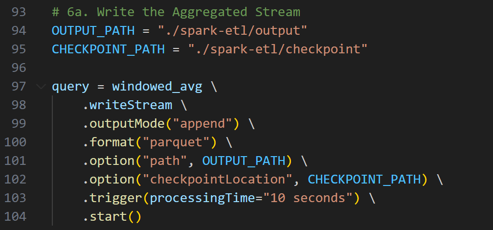

### **6b Write the Raw Flagged Stream (Optional)**

 A dual-write pattern demonstrating how multiple queries can run concurrently on the same SparkSession, writing the raw, non-aggregated records to a separate directory.  

```python
RAW_OUTPUT = "./spark-etl/raw"
RAW_CHECKPOINT = "./spark-etl/checkpoint-raw"

query_raw = flagged_stream \
    .writeStream \
    .outputMode("append") \
    .format("parquet") \
    .option("path", RAW_OUTPUT) \
    .option("checkpointLocation", RAW_CHECKPOINT) \
    .trigger(processingTime="10 seconds") \
    .start()

print("Streaming query started. Press Ctrl+C to stop.")
spark.streams.awaitAnyTermination()
```

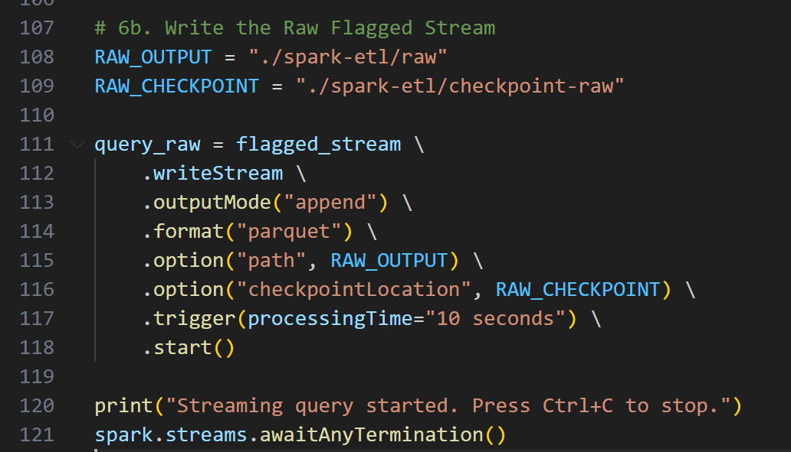


## **Step 7: Run the Full Pipeline**

### **7a Start the Spark Job**

Submits the completed Python script (`etl_pipeline.py`) to the Spark engine via the command line.  

When you run `python etl_pipeline.py`, Spark will start in the background and automatically handle the package dependencies, so there is no need to submit it.

```bash
$env:JAVA_HOME=""
python etl_pipeline.py
```

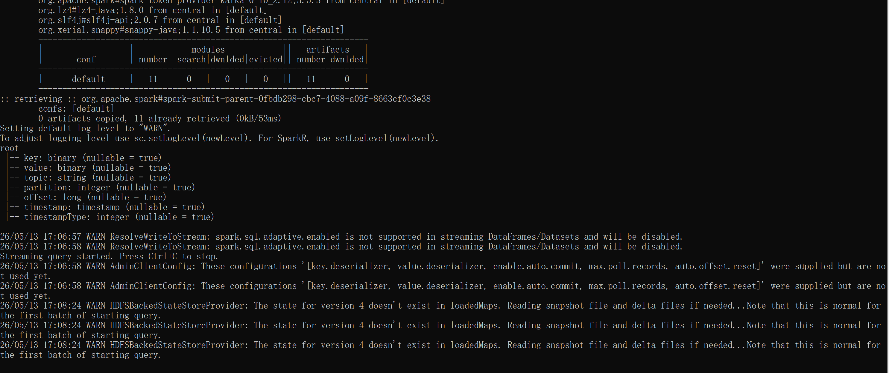

### **7b Send Messages from the Producer**

Uses a separate terminal and script to publish mock sensor data into the Kafka topic.  

```bash
python producer.py
```

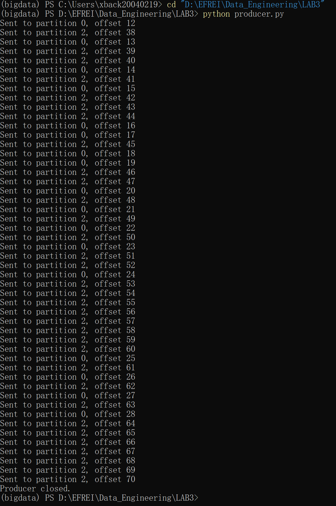

Simulated live data is now flowing into the pipeline, triggering transformations and disk writes in the Spark application.  

### **7c Inspect the Parquet Output**

Uses an interactive Spark shell to read the generated Parquet files and verify the pipeline's output.  

```python
from pyspark.sql import SparkSession
spark = SparkSession.builder.master("local[*]").getOrCreate()

df = spark.read.parquet("./spark-etl/output")
df.printSchema()
df.orderBy("window.start", "sensor").show(truncate=False)
```

`spark.read.parquet()` reads all files in the directory. Because Parquet is columnar, reading specific columns is highly efficient.  

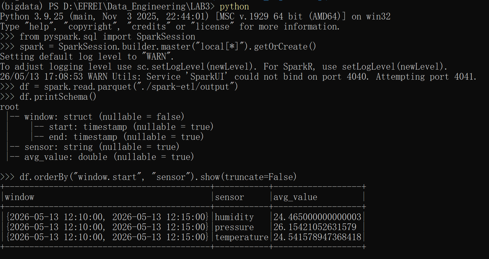

Validates that the full ETL pipeline successfully ingested, transformed, windowed, and persisted the data accurately.


## **Reflection Questions**

**1. The `value` column from Kafka is in binary format. What happens if you call `.filter(col(“value”) > 30)` directly on the raw data stream before parsing it?**
You will encounter calculation errors or unexpected behavior because the `value` column contains raw binary bytes, not numeric values. Spark cannot perform mathematical operations directly on binary strings and integers/double-precision numbers; you must first cast them to strings and parse them using functions like `from_json`.


**2. You set `.trigger(processingTime=“10 seconds”)`. What trade-offs does this create between latency, throughput, and the number of generated Parquet files?**
A 10-second processing time means micro-batches execute quickly, providing low latency for downstream consumers. However, compared to larger batches, this reduces overall throughput; moreover, since Spark creates a new file for each batch in every partition, this frequent triggering generates a large number of very small Parquet files. Longer intervals increase latency but improve throughput and result in fewer, larger files.  


**3. Explain in your own words why watermarks are necessary for windowed aggregation. What would happen without watermarks?** 
Watermarks define the maximum threshold for late data. In an unbounded data stream, without watermarks, Spark would never be able to determine when it is safe to close a time window. Consequently, it would have to permanently store the aggregate state of all past windows in memory, eventually leading to out-of-memory errors. Watermarks allow Spark to safely expire old states.  


**4. Your Spark job crashes after writing the 5th batch of data. When you restart the task, from which batch will Spark begin processing, and why?** 
It will start processing from the 6th batch. This is because the pipeline uses a checkpoint directory (`checkpointLocation`), which stores the stream processing state, including the exact Kafka offsets read so far. Upon restart, Spark reads the checkpoint to determine where processing was last interrupted, thereby avoiding the need to reprocess data starting from the very first offset.


**5. You want to add a new transformation operation to the pipeline (e.g., converting Celsius to Fahrenheit). Where in the code should this operation be inserted? Is it necessary to change the checkpoint directory?** 
It should be inserted after the JSON parsing step or the filtering step, but must be placed *before* the windowed aggregation to ensure that the average is calculated based on the correct metrics. Adding a new transformation effectively changes the processing DAG and may affect the data schema. If this change involves stateful operations, Spark will be unable to reuse existing checkpoints and will require a new checkpoint directory (or clearing the old directory) to successfully restart the job. 