# Lab 4 Report

# Designing and Managing Data Lakes


## Step 0: Setup

### 0a: Create the Data Lake Directory Structure

Setting up the physical directory hierarchy for our three-zone data lake (Bronze/Silver/Gold) on the local filesystem to simulate object storage like S3 or HDFS.  

```powershell
# Define base path
$baseDir = "D:\EFREI\Data_Engineering\LAB4\datalake"

# Create directories
New-Item -ItemType Directory -Force -Path "$baseDir\raw\source=kafka\topic=sensor-events"
New-Item -ItemType Directory -Force -Path "$baseDir\curated\domain=iot"
New-Item -ItemType Directory -Force -Path "$baseDir\consumption\use_case=sensor_averages"

# Verify structure
Get-ChildItem -Path $baseDir -Recurse -Directory
```

The document uses bash brace expansion, which isn't native to PowerShell. We use `New-Item -Force` to recursively create the necessary nested directories.  

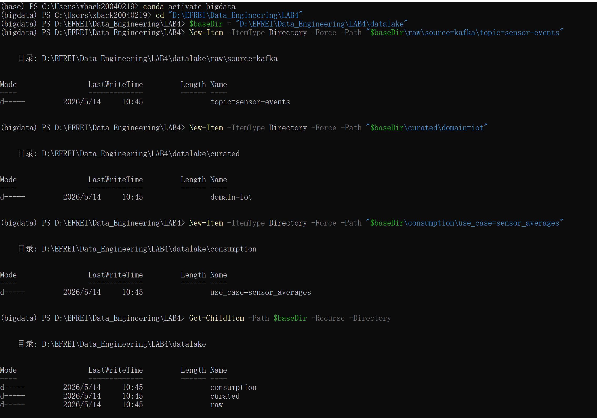

### 0b: Ensure the Kafka Cluster and Topic Are Ready

Verifying that the Kafka source is running and contains sensor event messages to stream into our data lake.  

```powershell
# Verify containers are running
docker compose ps

# List topics
docker exec kafka1 kafka-topics --bootstrap-server kafka1:29092 --list

# Produce sample messages (assuming producer.py exists from a previous lab)
python producer.py
```

 Ensuring `sensor-events` exists and has data is critical so Spark has messages to read.  

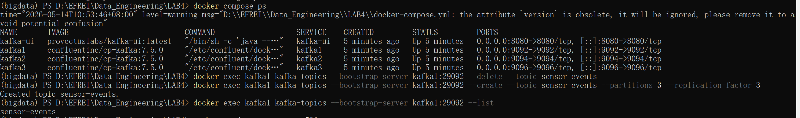

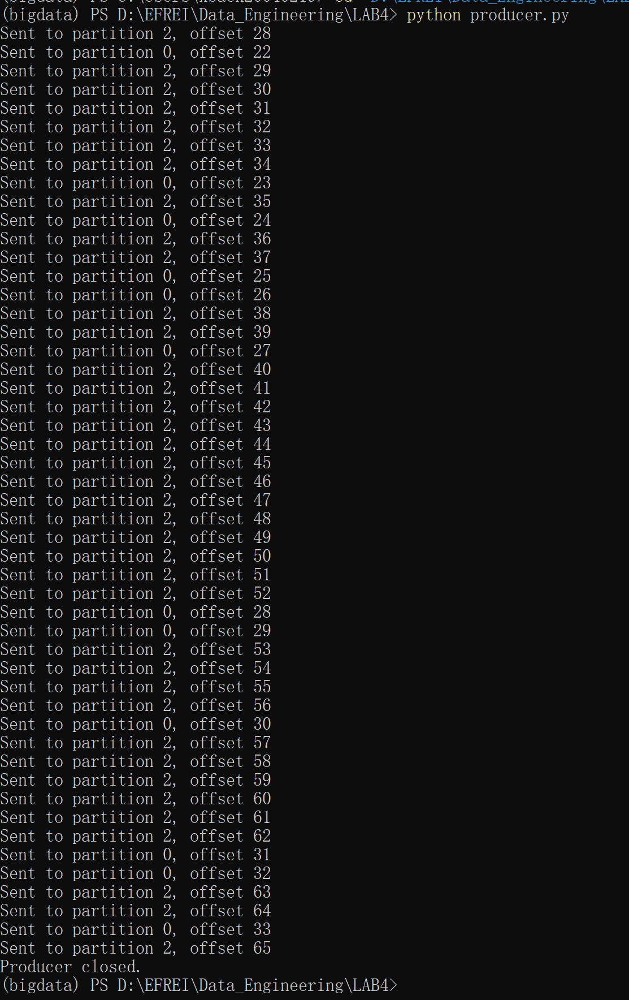


## Step 1: Raw Zone - Land Data from Kafka

*(Create a Python file named `datalake_pipeline.py` and add the following blocks)*

### 1a: Imports and SparkSession

 Initializing the Spark application and defining core configuration paths.  

```python
from pyspark.sql import SparkSession
from pyspark.sql.functions import (
    col, from_json, to_timestamp, expr, year, month, dayofmonth, hour, lit
)
from pyspark.sql.types import (
    StructType, StructField, StringType, DoubleType, LongType, BooleanType
)
import os

# Set up local paths relative to the current working directory
LAKE_ROOT = "./datalake"
RAW_PATH = f"{LAKE_ROOT}/raw/source=kafka/topic=sensor-events"
CURATED_PATH = f"{LAKE_ROOT}/curated/domain=iot"
CONSUME_PATH = f"{LAKE_ROOT}/consumption/use_case=sensor_averages"
CKPT_RAW = "./datalake-ckpt/raw"
CKPT_CUR = "./datalake-ckpt/curated"

KAFKA_BROKERS = "localhost:9092,localhost:9094,localhost:9096"
TOPIC = "sensor-events"

spark = SparkSession.builder \
    .appName("Data Lake Pipeline") \
    .master("local[*]") \
    .config("spark.jars.packages", "org.apache.spark:spark-sql-kafka-0-10_2.12:3.5.3") \
    .config("spark.sql.shuffle.partitions", "3") \
    .getOrCreate()

spark.sparkContext.setLogLevel("WARN")
```

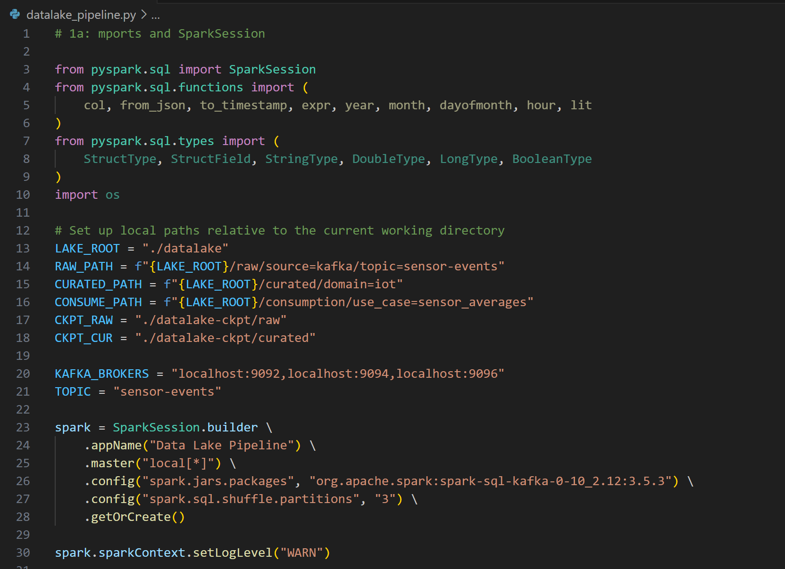

### 1b: Define Schema and Read Raw Kafka Stream

Defining the expected structure of incoming data and connecting Spark to the Kafka topic as a streaming source.  

```python
SENSOR_SCHEMA = StructType([
    StructField("sensor", StringType(), False),
    StructField("value", DoubleType(), False),
    StructField("unit", StringType(), True),
    StructField("timestamp", LongType(), False),
    StructField("source", StringType(), True),
    StructField("anomaly", BooleanType(), True),
])

raw_kafka = spark.readStream \
    .format("kafka") \
    .option("kafka.bootstrap.servers", KAFKA_BROKERS) \
    .option("subscribe", TOPIC) \
    .option("startingOffsets", "earliest") \
    .option("failOnDataLoss", "false") \
    .load()
```

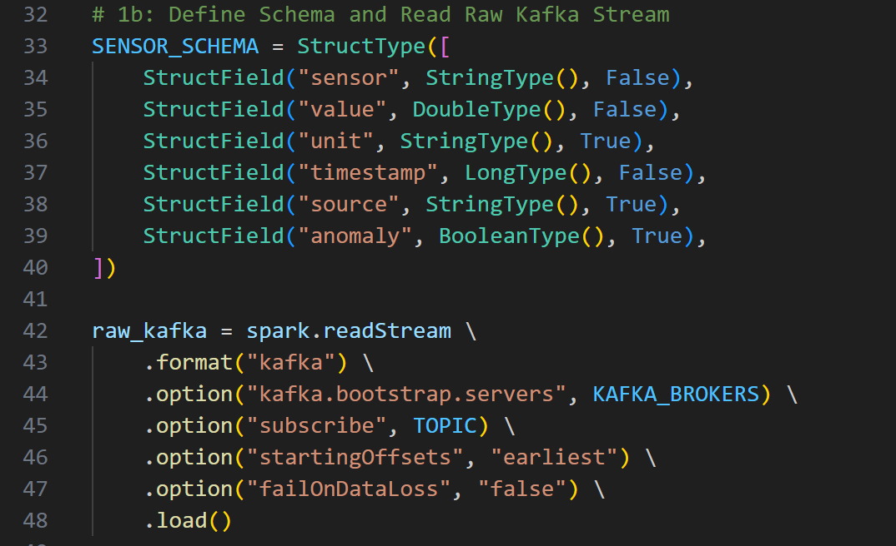

### 1c: Write Raw Zone (JSON format, partitioned by date)

Saving the raw bytes from Kafka exactly as they arrived (as JSON), partitioned by the ingestion timestamp. This acts as our immutable audit trail.  

```python
raw_for_lake = raw_kafka.select(
    col("value").cast("string").alias("raw_json"),
    col("partition").alias("kafka_partition"),
    col("offset").alias("kafka_offset"),
    col("timestamp").alias("ingestion_ts"),
    year(col("timestamp")).alias("year"),
    month(col("timestamp")).alias("month"),
    dayofmonth(col("timestamp")).alias("day"),
    hour(col("timestamp")).alias("hour")
)

query_raw = raw_for_lake.writeStream \
    .outputMode("append") \
    .format("json") \
    .option("path", RAW_PATH) \
    .option("checkpointLocation", CKPT_RAW) \
    .partitionBy("year", "month", "day", "hour") \
    .trigger(processingTime="30 seconds") \
    .start()
```

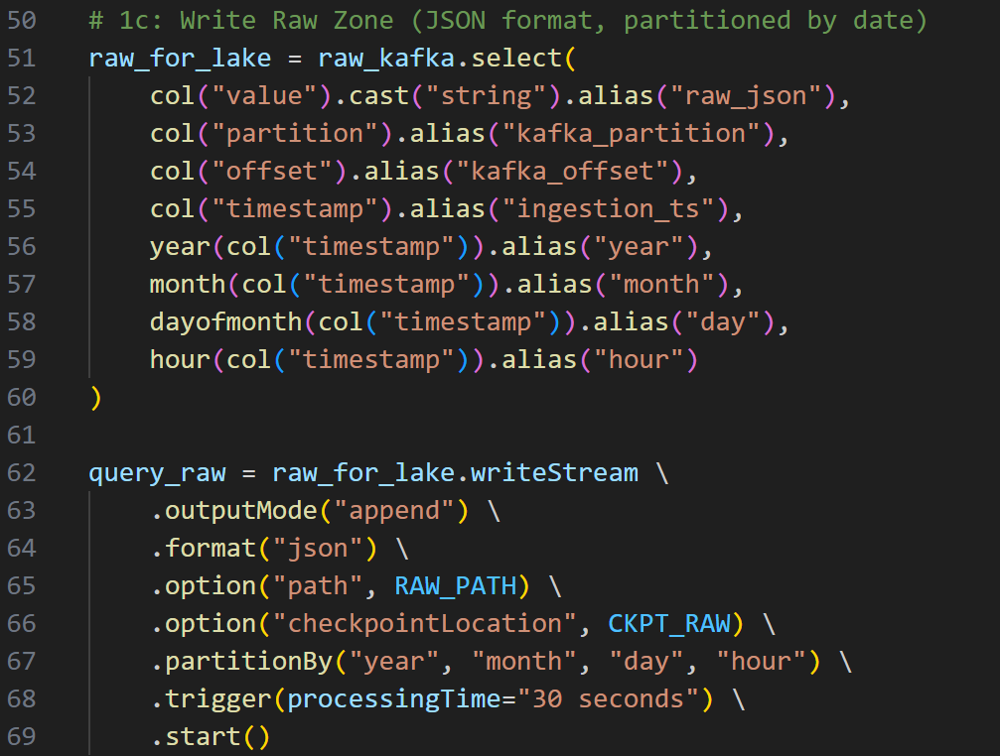

## Step 2: Curated Zone - Clean, Parse, and Partition

### 2a: Parse and Validate

Extracting the JSON string into typed columns and applying data quality gates (e.g., filtering out nulls and physically impossible sensor values).  

```python
parsed = raw_kafka.select(
    from_json(col("value").cast("string"), SENSOR_SCHEMA).alias("d"),
    col("partition"),
    col("offset")
).select(
    col("d.sensor").alias("sensor_type"),
    col("d.value"),
    col("d.unit"),
    col("d.anomaly").alias("is_anomaly"),
    to_timestamp(expr("d.timestamp / 1000")).alias("event_time"),
    col("partition"),
    col("offset")
).filter(col("sensor_type").isNotNull()) \
 .filter(col("value").isNotNull()) \
 .filter(col("value").between(-100, 2000))
```

`between(-100, 2000)` enforces data quality. Event time (when the sensor actually recorded the data) is extracted here.  

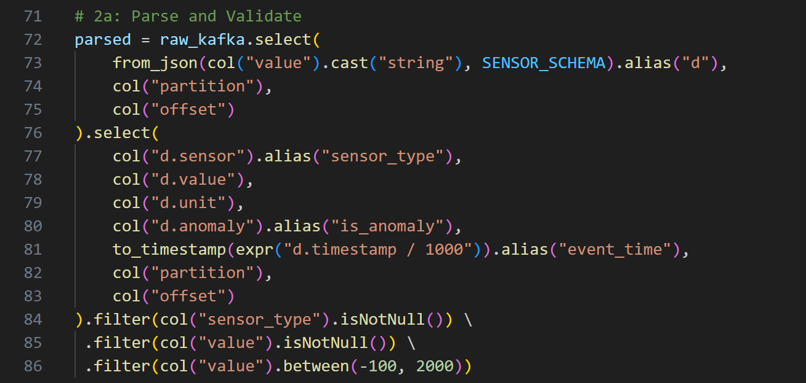

### 2b: Add Partitioning Columns from Event Time

 Creating explicit date columns from the `event_time` to be used for Hive-style directory partitioning.  

```python
curated = parsed \
    .withColumn("year", year(col("event_time"))) \
    .withColumn("month", month(col("event_time"))) \
    .withColumn("day", dayofmonth(col("event_time")))
```

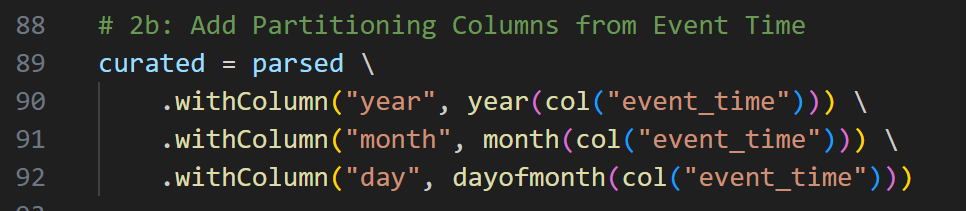

### 2c & 2d: Write Curated Zone (Parquet) and Start

Writing the cleaned data in a columnar format (Parquet) compressed with Snappy, and telling Spark to wait for the streams to finish.  

```python
query_curated = curated.writeStream \
    .outputMode("append") \
    .format("parquet") \
    .option("path", CURATED_PATH) \
    .option("checkpointLocation", CKPT_CUR) \
    .option("compression", "snappy") \
    .partitionBy("sensor_type", "year", "month", "day") \
    .trigger(processingTime="30 seconds") \
    .start()

print("Data lake pipeline running. Ctrl+C to stop.")
try:
    spark.streams.awaitAnyTermination()
except KeyboardInterrupt:
    print("Stopping all queries...")
    for q in spark.streams.active:
        q.stop()
```

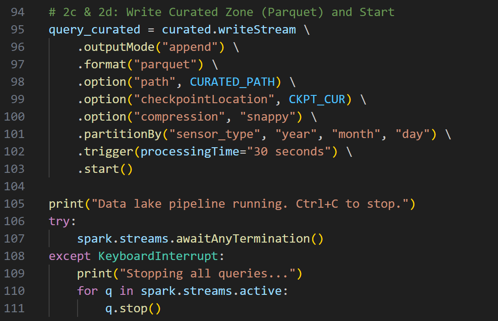

### 2e: Run `datalake_pipeline.py` 

```powershell
python datalake_pipeline.py
```

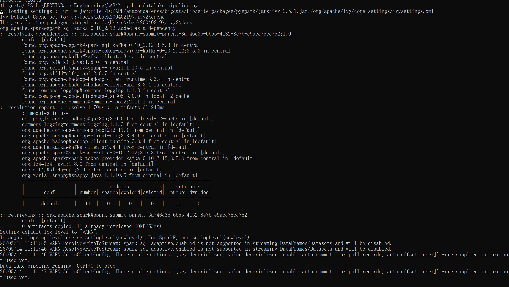

Wait about 1–2 minutes to ensure that the previously generated messages have been written to disk.
Press Ctrl+C to stop the script.


## Step 3: Consumption Zone - Build Aggregated Dataset

Run this in a new PySpark interactive shell after stopping Step 2.

Enter the standard Python interactive environment

```powershell
python
```

Manually initialize Spark with Kafka dependencies

```python
from pyspark.sql import SparkSession

spark = SparkSession.builder \
    .appName("InteractiveShell") \
    .master("local[*]") \
    .config("spark.jars.packages", "org.apache.spark:spark-sql-kafka-0-10_2.12:3.5.3") \
    .getOrCreate()

spark.sparkContext.setLogLevel("WARN")
```

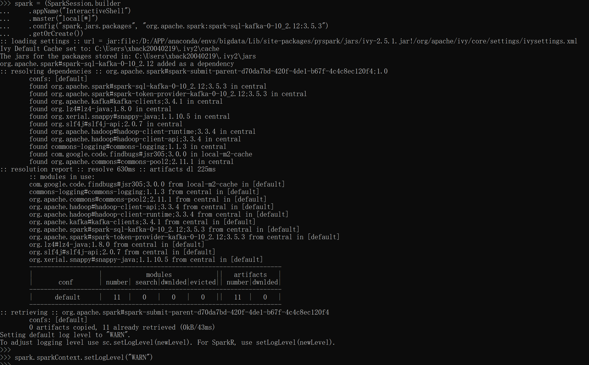

Creating the Gold layer by running a batch job over the curated data to build a pre-aggregated, business-ready table.  

```python
from pyspark.sql import SparkSession
from pyspark.sql.functions import avg, min, max, count, sum, col

spark = SparkSession.builder.appName("ConsumptionJob").master("local[*]").getOrCreate()

LAKE_ROOT = "./datalake"
CURATED_PATH = f"{LAKE_ROOT}/curated/domain=iot"
CONSUME_PATH = f"{LAKE_ROOT}/consumption/use_case=sensor_averages"

# Read curated
curated_df = spark.read.format("parquet").load(CURATED_PATH)
print(f"Curated zone: {curated_df.count()} records")

# Aggregate
daily_agg = curated_df \
    .groupBy("sensor_type", "year", "month", "day") \
    .agg(
        count("value").alias("record_count"),
        avg("value").alias("avg_value"),
        min("value").alias("min_value"),
        max("value").alias("max_value"),
        sum(col("is_anomaly").cast("int")).alias("anomaly_count")
    ).orderBy("sensor_type", "year", "month", "day")

# Write consumption
daily_agg.write \
    .mode("overwrite") \
    .partitionBy("sensor_type", "year", "month") \
    .parquet(CONSUME_PATH)

print("Consumption zone written.")
daily_agg.show(20, truncate=False)
```

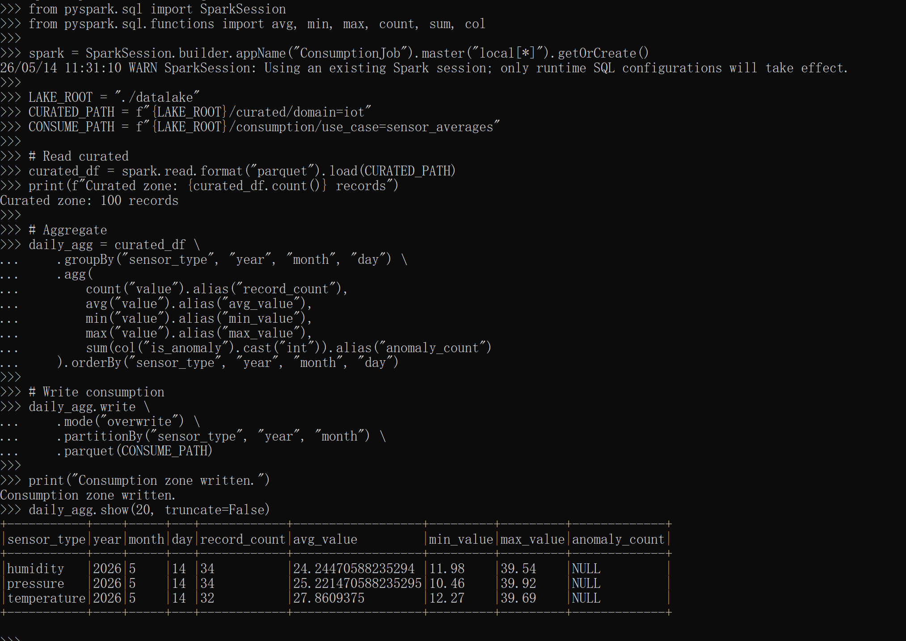

## Step 4: Query with Spark SQL and Partition Pruning

### 4a: Register the Curated Dataset as a Table

Exposing the Parquet files as a virtual SQL table for querying.  

```python
curated_df = spark.read.parquet(CURATED_PATH)
curated_df.createOrReplaceTempView("sensor_curated")
curated_df.printSchema()
```

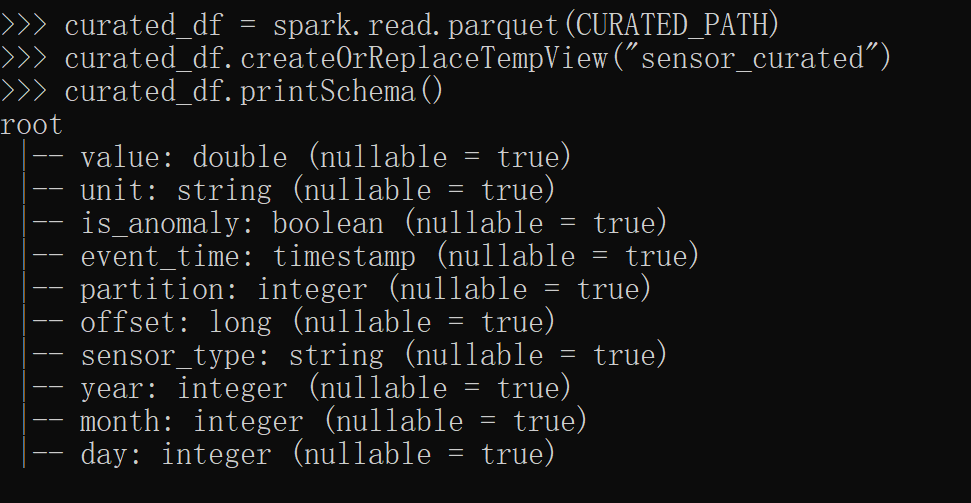

### 4b: Query 1: Basic Partition Pruning

Executing business queries. Query 1 demonstrates filtering on partition columns (`sensor_type`, `year`, `month`). 

```python
# Query 1
result1 = spark.sql("""
    SELECT sensor_type, day,
           ROUND(AVG(value), 2) AS avg_value,
           ROUND(MIN(value), 2) AS min_value,
           ROUND(MAX(value), 2) AS max_value,
           COUNT(*) AS total_records
    FROM sensor_curated
    WHERE sensor_type = 'temperature'
      AND year = 2026 AND month = 5
    GROUP BY sensor_type, day
    ORDER BY day
""")
result1.show()
```

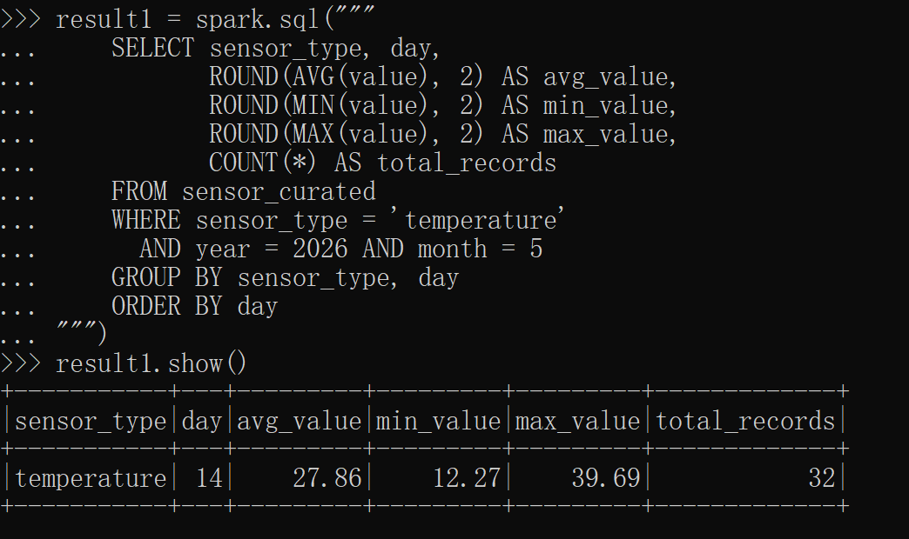

### 4c: Query 2: Anomaly Analysis

Query 2 calculates anomaly percentages.  

```python
# Query 2
result2 = spark.sql("""
    SELECT sensor_type,
           COUNT(*) AS total,
           SUM(CAST(is_anomaly AS INT)) AS anomalies,
           ROUND(100.0 * SUM(CAST(is_anomaly AS INT)) / COUNT(*), 2) AS anomaly_pct
    FROM sensor_curated
    GROUP BY sensor_type
    ORDER BY anomaly_pct DESC
""")
result2.show()
```

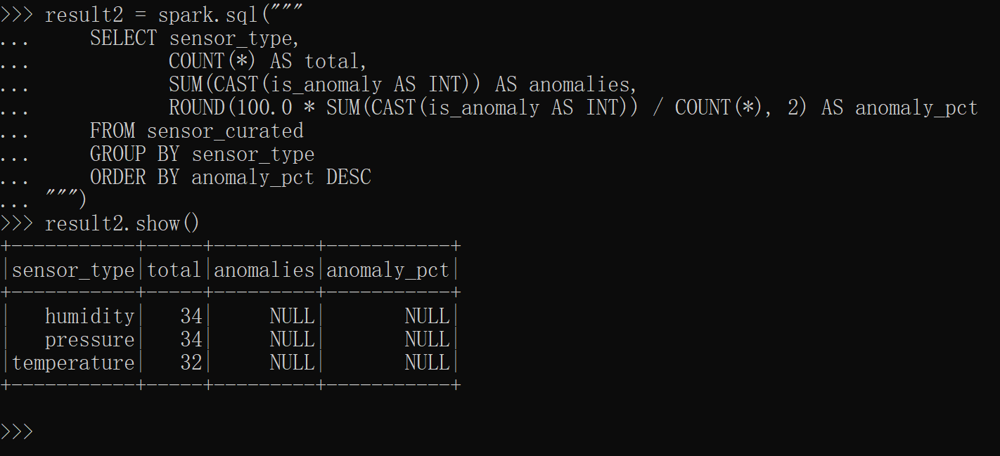

### 4d: Measure the Pruning Benefit

 Comparing the execution time of a full table scan versus a pruned scan.  

```python
import time

start = time.time()
spark.sql("SELECT COUNT(*) FROM sensor_curated").collect()
full_scan_time = time.time() - start

start = time.time()
spark.sql("SELECT COUNT(*) FROM sensor_curated WHERE sensor_type = 'temperature'").collect()
pruned_time = time.time() - start

print(f"Full scan time: {full_scan_time:.2f}s")
print(f"Pruned scan time: {pruned_time:.2f}s")
print(f"Speedup: {full_scan_time/pruned_time:.1f}x")
```

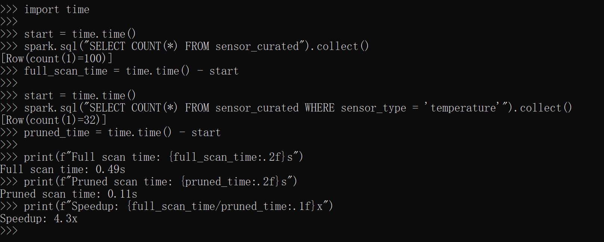


## Reflection Questions

**1. You have a dataset with columns: user_id (10M distinct values), country (50 values), event_date, event_type (8 values). Which columns would you choose for partitioning and why?** 

I would choose `event_date` and `event_type` . `event_date` is excellent because most analytical queries filter by time, aligning with data retention policies. `event_type` has low cardinality (8 values) and is likely a common filter. 

**2. Explain why the raw zone uses ingestion time for its directory partitioning, while the curated zone uses event time. In what situation could a gap between the two times indicate a problem?**

The raw zone uses ingestion time because it answers the operational question "when did this data arrive in our system?", which is crucial for debugging pipeline delays. The curated zone uses event time because business queries need to know when the real-world measurement actually happened. A large gap between ingestion time and event time indicates a pipeline delay, network latency, or an outage where the source system held onto messages before finally successfully sending them to Kafka.  

**3. What is the "small file problem" and what are its two main consequences on query performance?** 

The small file problem occurs when a data lake is populated with thousands of tiny files (often caused by frequent streaming micro-batches). Its main consequences are:  

High metadata overhead: Systems like HDFS/S3 struggle to process the metadata of 10,000 x 1MB files compared to 100 x 100MB files, slowing down reads significantly.  

Reduced write/read performance and limited parallelism due to excessive task scheduling overhead in Spark.  

**4. A new field firmware_version is added to the sensor payload starting January 20. Old Parquet files (before Jan 20) do not have this field. What happens when Spark reads both old and new files together?** 

Thanks to Parquet's schema evolution support, Spark will seamlessly read both files together. For the old files (before Jan 20), Spark will automatically return `null` values for the `firmware_version` column, without failing or requiring the old files to be rewritten.  

**5. You delete the curated zone checkpoint and restart the streaming pipeline. What happens to the raw zone checkpoint? Does data get duplicated in the curated zone?** 

The raw zone checkpoint remains unaffected, as it is managed by a separate streaming query with its own checkpoint directory (`CKPT_RAW`). However, because the curated zone checkpoint was deleted, Spark loses track of which offsets it had previously processed from `raw_kafka`. When restarted, the curated streaming query will process from the beginning ("earliest"), resulting in data being duplicated in the curated Parquet files.