# Lab 5  Report: 

# APIs & Web Services I


## Step 0 - Setup   

### 0a Install Dependencies   

Prepare the Python virtual environment by installing Flask and other required data processing libraries.  

Since I'm using an Anaconda virtual environment, I don't need to create a new one; I can just install Flask and the other necessary data processing libraries directly.

```powershell
pip install flask kafka-python-ng pyspark==3.5.3
```


### 0b Verify Data Lake Has Data   

Ensure that the curated Parquet files generated from the previous lab4 exist, and apply necessary Python 3.12+ compatibility fixes.  

```powershell
Get-ChildItem -Path "D:\EFREI\Data_Engineering\LAB\Lab4\datalake\curated\domain=iot" -ErrorAction SilentlyContinue
```


### 0c Project Structure   

Create the directory structure to separate the API routing logic from the utility functions.  

```powershell
New-Item -ItemType Directory -Path "sensor_api" -Force
# We will create these files inside:
# sensor_api/app.py (Flask application)
# sensor_api/kafka_utils.py (Kafka consumer helper)
# sensor_api/lake_utils.py (Parquet query helper)
```


Create the kafka_utils.py

```python
# sensor_api/kafka_utils.py
from kafka import KafkaProducer, KafkaConsumer
import json

KAFKA_BROKER = 'localhost:9092'
TOPIC_NAME = 'sensor-events' 

def publish_reading(reading):
    """Publish a new reading to Kafka and return metadata."""
    producer = KafkaProducer(
        bootstrap_servers=[KAFKA_BROKER],
        value_serializer=lambda v: json.dumps(v).encode('utf-8')
    )
    future = producer.send(TOPIC_NAME, reading)
    result = future.get(timeout=10)
    return {"partition": result.partition, "offset": result.offset}

def get_latest_readings(sensor_type, n=1):
    """Consume recent messages and return the latest 'n' readings for a sensor type."""
    consumer = KafkaConsumer(
        TOPIC_NAME,
        bootstrap_servers=[KAFKA_BROKER],
        auto_offset_reset='earliest',
        enable_auto_commit=False,
        value_deserializer=lambda x: json.loads(x.decode('utf-8', errors='ignore')),
        consumer_timeout_ms=5000  
    )
    
    records = []
    for message in consumer:
        val = message.value
        if isinstance(val, dict) and val.get("sensor") == sensor_type:
            records.append(val)
            
    records.sort(key=lambda r: r.get("timestamp") or 0, reverse=True)
    
    return records[:n]
```

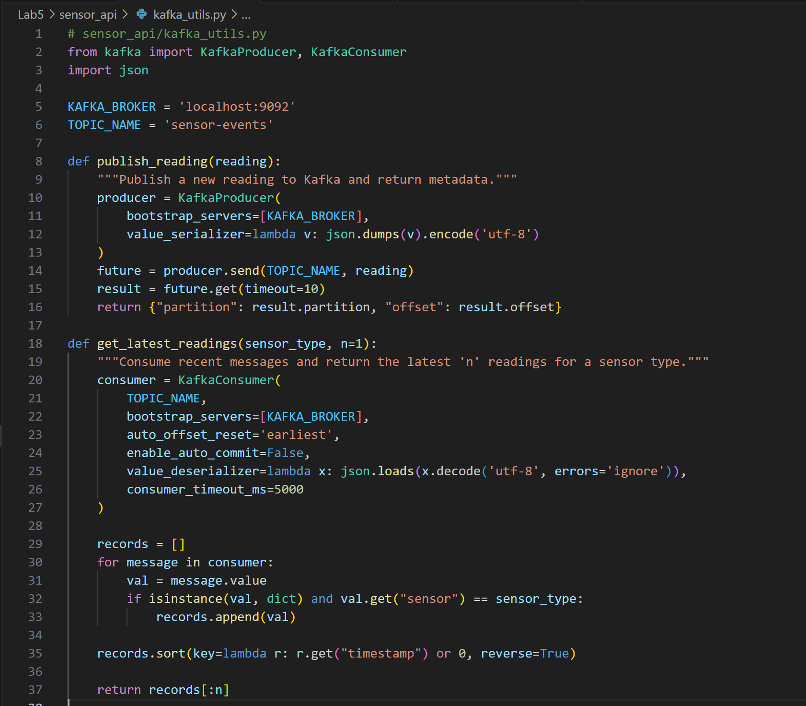

Create the lake_utils.py

```python
# sensor_api/lake_utils.py
import os
from pyspark.sql import SparkSession
from pyspark.sql.functions import col
os.environ['HADOOP_HOME'] = r"D:\EFREI\Data_Engineering\LAB\Lab3\hadoop"
DATALAKE_PATH = r"D:\EFREI\Data_Engineering\LAB\Lab4\datalake\curated\domain=iot"
def _get_spark():
    """Initialize SparkSession."""
    try:
        spark = SparkSession.builder \
            .appName("SensorAPI") \
            .master("local[*]") \
            .getOrCreate()
        return spark
    except Exception as e:
        print(f"Failed to start Spark: {e}")
        return None
def get_sensor_types():
    """Read Parquet files to get all distinct sensor types."""
    try:
        spark = _get_spark()
        if not spark:
            return []
        df = spark.read.parquet(DATALAKE_PATH)
        types = [row[0] for row in df.select("sensor_type").distinct().collect()]
        return types
    except Exception as e:
        print(f"Error reading datalake for sensor types: {e}")
        return []

def get_statistics(sensor_type, days=7):
    """Mock statistics retrieval from Parquet."""
    try:
        spark = _get_spark()
        if not spark:
            return []
        
        df = spark.read.parquet(DATALAKE_PATH)
        stats_df = df.filter(col("sensor_type") == sensor_type).limit(days)
        
        return [row.asDict() for row in stats_df.collect()]
    except Exception as e:
        print(f"Error reading stats: {e}")
        return []
```

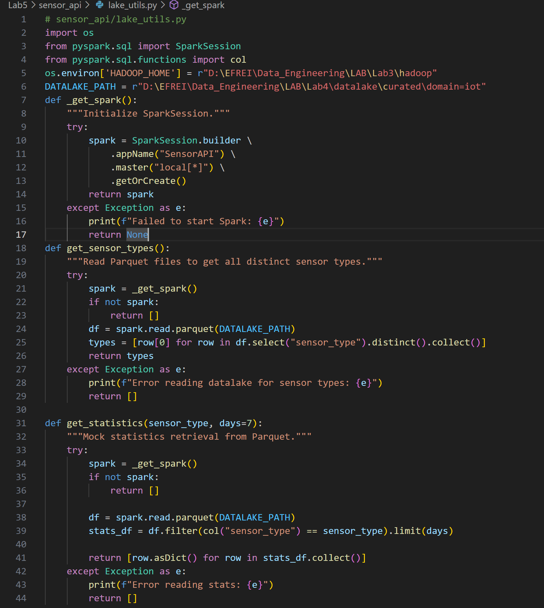

## Step 1 - Application Factory and Health Check   

### 1a Create app.py   

Initialize the Flask application entry point, define global metadata, and import necessary utilities.  

```python
# sensor_api/app.py
from flask import Flask, jsonify, request, abort
from datetime import datetime, timezone
from kafka_utils import get_latest_readings, publish_reading
from lake_utils import get_statistics, get_sensor_types

app = Flask(__name__)

# API Metadata
API_VERSION = "1.0"
API_PREFIX = "/api/v1"
```

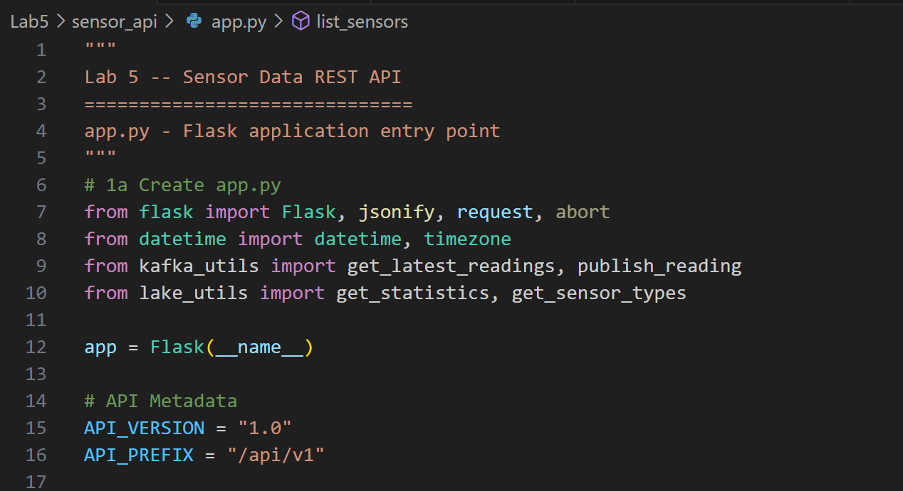

### 1b Health Check Endpoint   

Create a mandatory endpoint used by load balancers and monitoring systems to verify the API is running.  

```python
@app.route(f"{API_PREFIX}/health")
def health():
    return jsonify({
        "status": "ok",
        "version": API_VERSION,
        "timestamp": datetime.now(timezone.utc).isoformat(),
        "service": "sensor-data-api",
    }), 200
```

  


## Step 2 - Sensor List and Latest Reading Endpoints   

### 2a List All Sensor Types   

 Create a `GET` endpoint to retrieve the list of all known sensor types from the Parquet curated zone.  

```python
@app.route(f"{API_PREFIX}/sensors")
def list_sensors():
    try:
        sensor_types = get_sensor_types()
        return jsonify({
            "status": "success",
            "count": len(sensor_types),
            "data": sensor_types,
        }), 200
    except Exception as exc:
        app.logger.error("list_sensors error: %s", exc)
        return jsonify({
            "status": "error",
            "message": "Failed to retrieve sensor list.",
        }), 500
```


### 2b Get Latest Reading for a Sensor Type   

Create an endpoint that extracts a path parameter to query the most recent reading from Kafka.  

```python
VALID_SENSORS = {"temperature", "humidity", "pressure"}

@app.route(f"{API_PREFIX}/sensors/<sensor_type>/latest")
def latest_reading(sensor_type: str):
    if sensor_type not in VALID_SENSORS:
        return jsonify({
            "status": "error",
            "message": (f"Unknown sensor type '{sensor_type}'. "
                        f"Valid types: {sorted(VALID_SENSORS)}")
        }), 404
    try:
        reading = get_latest_readings(sensor_type, n=1)
        if not reading:
            return jsonify({
                "status": "error",
                "message": f"No readings available for sensor '{sensor_type}'."
            }), 404

        return jsonify({
            "status": "success",
            "data": reading[0],
        }), 200
    except Exception as exc:
        app.logger.error("latest_reading error: %s", exc)
        return jsonify({
            "status": "error",
            "message": "Failed to retrieve latest reading.",
        }), 500
```


## Step 3 - Statistics from the Parquet Data Lake   

Create an endpoint to return daily statistics for a sensor type, utilizing query parameters for filtering.  

```python
@app.route(f"{API_PREFIX}/sensors/<sensor_type>/stats")
def sensor_stats(sensor_type: str):
    if sensor_type not in VALID_SENSORS:
        return jsonify({
            "status": "error",
            "message": f"Unknown sensor type '{sensor_type}'.",
        }), 404
    try:
        days = int(request.args.get("days", 7))
        if days < 1 or days > 90:
            raise ValueError("days must be between 1 and 90")
    except (ValueError, TypeError) as exc:
        return jsonify({
            "status": "error",
            "message": f"Invalid 'days' parameter: {exc}",
        }), 400

    try:
        stats = get_statistics(sensor_type, days=days)
        return jsonify({
            "status": "success",
            "sensor_type": sensor_type,
            "days": days,
            "count": len(stats),
            "data": stats,
        }), 200
    except Exception as exc:
        app.logger.error("sensor_stats error: %s", exc)
        return jsonify({
            "status": "error",
            "message": "Failed to retrieve statistics.",
        }), 500
```


## Step 4 - POST: Write a Reading to Kafka   

Create a POST endpoint to publish new sensor readings to the Kafka topic, handling JSON request bodies.  

```python
import json
REQUIRED_FIELDS = {"sensor", "value"}

@app.route(f"{API_PREFIX}/readings", methods=["POST"])
def create_reading():
    body = request.get_json(silent=True)
    if body is None:
        return jsonify({
            "status": "error",
            "message": "Request body must be valid JSON. Set Content-Type: application/json."
        }), 400

    missing = REQUIRED_FIELDS - set(body.keys())
    if missing:
        return jsonify({
            "status": "error",
            "message": f"Missing required fields: {missing}"
        }), 400

    sensor = body["sensor"]
    if sensor not in VALID_SENSORS:
        return jsonify({
            "status": "error",
            "message": f"Invalid sensor type '{sensor}'."
        }), 422

    try:
        value = float(body["value"])
    except (ValueError, TypeError):
        return jsonify({
            "status": "error",
            "message": "'value' must be a number."
        }), 422

    reading = {
        "sensor": sensor,
        "value": value,
        "unit": body.get("unit", ""),
        "timestamp": int(datetime.now(timezone.utc).timestamp() * 1000),
        "source": "api-v1",
        "anomaly": False,
    }

    try:
        metadata = publish_reading(reading)
        return jsonify({
            "status": "success",
            "message": "Reading published to Kafka.",
            "data": {
                "reading": reading,
                "partition": metadata["partition"],
                "offset": metadata["offset"],
            }
        }), 201
    except Exception as exc:
        app.logger.error("create_reading error: %s", exc)
        return jsonify({
            "status": "error",
            "message": "Failed to publish reading."
        }), 500
```


## Step 5 - Error Handlers   

Register global handlers to capture unhandled Flask exceptions and enforce JSON-formatted responses.  

```python
@app.errorhandler(404)
def not_found(error):
    return jsonify({
        "status": "error",
        "code": 404,
        "message": "The requested resource was not found.",
    }), 404

@app.errorhandler(405)
def method_not_allowed(error):
    return jsonify({
        "status": "error",
        "code": 405,
        "message": "HTTP method not allowed for this endpoint.",
    }), 405

@app.errorhandler(500)
def internal_error(error):
    return jsonify({
        "status": "error",
        "code": 500,
        "message": "An internal server error occurred.",
    }), 500

if __name__ == "__main__":
    app.run(host="0.0.0.0", port=5000, debug=True)
```


## Step 6 - Test with curl   

Open a second PowerShell terminal while `python sensor_api/app.py` is running in the first.  

```
python sensor_api/app.py
```


### 6a Health Check   

Verify the API is online and returning metadata.  

```powershell
curl.exe -s http://localhost:5000/api/v1/health | python -m json.tool
```

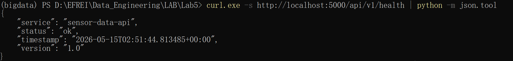

### 6b List Sensors   

Retrieve the list of active sensor types.  

```powershell
curl.exe -s http://localhost:5000/api/v1/sensors | python -m json.tool
```

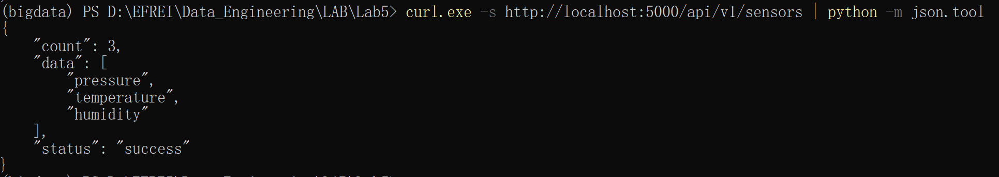

A JSON response containing a `"data"` array of sensor types (e.g., `["temperature", "humidity"]`). Successfully queries Parquet files via `lake_utils.py`.

### 6c Latest Reading   

Retrieve real-time reading from Kafka, and test 404 logic.  

```powershell
curl.exe -s http://localhost:5000/api/v1/sensors/temperature/latest | python -m json.tool
curl.exe -s http://localhost:5000/api/v1/sensors/radar/latest | python -m json.tool
```

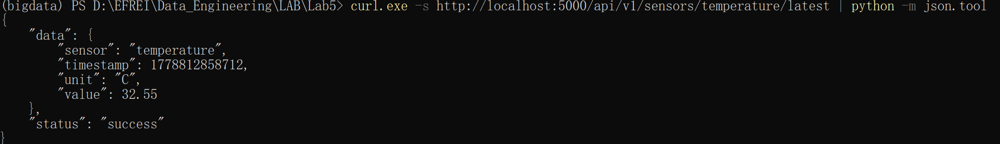

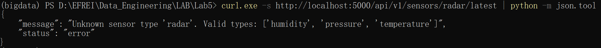

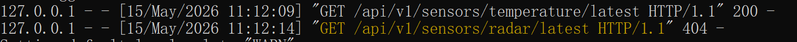

The first returns a JSON object with reading data (Status 200). The second returns `{"status": "error", "message": "Unknown sensor type 'radasr'..."}` (Status 404).  

Path validation is successfully rejecting unauthorized sensor types.

### 6d Statistics with Query Parameter   

Test the query parameter filtering and validation logic.  

```powershell
curl.exe -s "http://localhost:5000/api/v1/sensors/temperature/stats?days=3" | python -m json.tool
curl.exe -s "http://localhost:5000/api/v1/sensors/temperature/stats?days=abc" | python -m json.tool
```

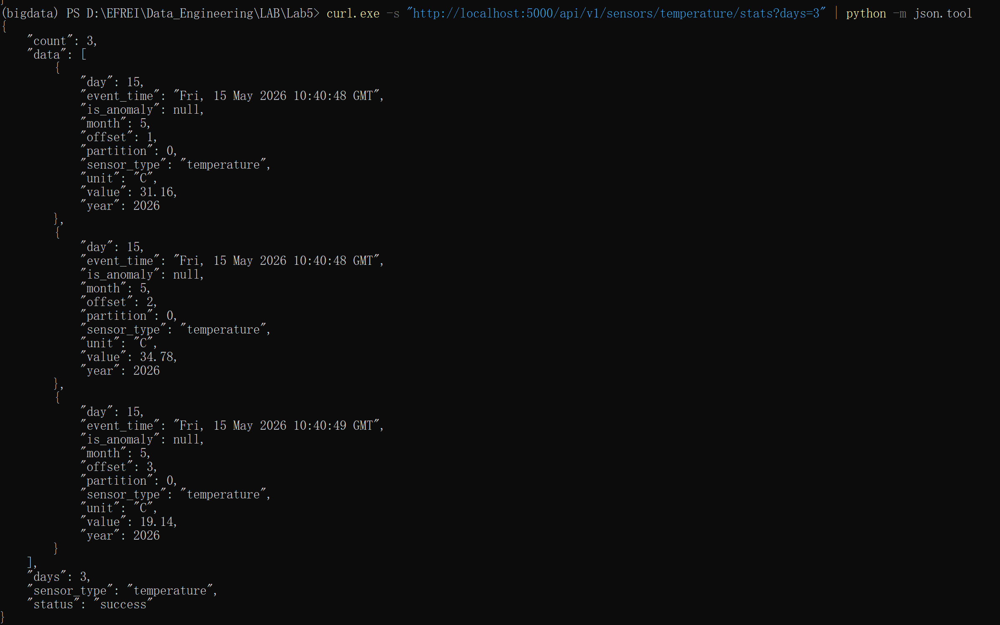

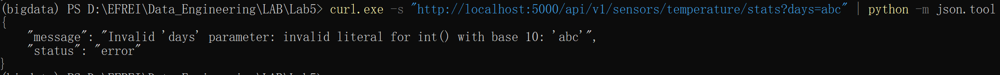

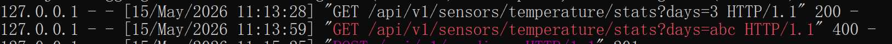

 First command returns aggregated data for 3 days (Status 200). Second command returns a 400 Bad request stating `Invalid `.  

The API correctly casts to integers and catches `ValueError`.

### 6e POST a New Reading   

Verify that the API accepts JSON payloads, publishes to Kafka, and properly handles validation rules.  

```powershell
# Successful POST
curl.exe -s -X POST http://localhost:5000/api/v1/readings -H "Content-Type: application/json" -d '{\"sensor\": \"temperature\", \"value\": 29.3, \"unit\": \"C\"}' | python -m json.tool

# Missing field (400)
curl.exe -s -X POST http://localhost:5000/api/v1/readings -H "Content-Type: application/json" -d '{\"sensor\": \"temperature\"}' | python -m json.tool

# Wrong Content-Type (400)
curl.exe -s -X POST http://localhost:5000/api/v1/readings -d "sensor=temperature&value=29.3" | python -m json.tool
```

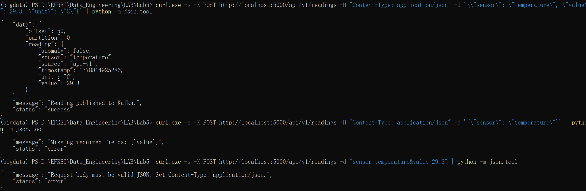

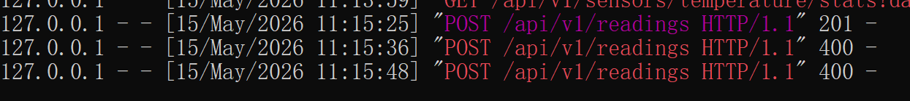

Success yields `201 Created` with partition/offset metadata. Errors return appropriate 400 JSON payloads.

Write pipeline is secured and functioning as intended.


## Reflection Questions

1. **A client sends `GET /api/v1/sensors/temperature/stats` with no days parameter. The default is 7. Is it correct to return 200 or 400? Justify your answer.  **

   It is correct to return a `200 OK`. The `days` parameter is a query parameter, which is meant to be optional for filtering collections. Since the API is designed to assign a sensible default value (7 days) when the parameter is absent, the request is valid and understood by the server, satisfying the criteria for a 200 success response.  

2. **Explain why `POST /readings` is not idempotent but `PUT /readings/42` (replacing reading 42) is. Give a concrete scenario where this distinction matters in a retry mechanism. **

   `POST /readings` is not idempotent because it is used to *create* a new resource; executing it multiple times will create multiple, duplicate resources. `PUT /readings/42` is idempotent because it replaces the specific resource entirely at that specific URI; calling it once or 100 times will result in the exact same server state. *Scenario:* If a network timeout occurs right after a client sends a request but before the response arrives, the client might trigger a retry. Retrying a `POST` could result in duplicate sensor readings in the database. Retrying a `PUT` is safe because it will just overwrite the resource with the exact same data again without creating duplicates.  

3. **A colleague suggests returning 200 OK for all responses and putting the status code in the JSON body (e.g., `{"status": 404, ...}`). What are the problems with this approach?  **

   This breaks standard HTTP and REST principles. Problems include:  

   **Caching mechanisms:** Intermediate caches and proxies look at HTTP headers to determine cacheability. A 200 response tells the proxy to cache a request that was actually an error.  

   **Load Balancing & Routing:** Load balancers rely on standard HTTP codes (like returning non-2xx statuses on a `/health` check) to remove failing instances from a pool.  

   **Client tool compatibility:** Standard HTTP clients (browsers, libraries, `curl`) evaluate request success based on HTTP headers, not the JSON payload. The client would have to write custom logic to parse the body to discover if an operation actually succeeded.

4. **What is the difference between a 400 Bad Request and a 422 Unprocessable Entity? Give one example of each for the `POST /readings` endpoint. **

   400 Bad Request indicates a request with bad or malformed syntax. Example: Sending invalid JSON or a payload missing the required `sensor` field.  

   422 Unprocessable Entity is used when the payload is syntactically valid JSON, but it fails semantic business validation. Example: Passing valid JSON but assigning a string to `value` instead of a float, or providing an invalid sensor type like `"radar"`.  

5. **The `GET /sensors/temperature/latest` endpoint queries Kafka. If the Kafka cluster is down, what HTTP status code should the API return? What should the response body look like? **

   The API should return a `503 Service Unavailable` (or `500 Internal Server Error`) indicating the server is temporarily failing to fulfill the request due to backend unreachability. The response body must *not* contain internal error details like stack traces, to prevent security vulnerabilities. It should be a structured, generic JSON response:  

```json
{
    "status": "error",
    "code": 503,
    "message": "Service temporarily unavailable. Failed to connect to data source."
}
```